## Лекция 1

> Пособие - Гарибов, СУБД MS SQL Server (не точно по пособию)

> Курсовой проект будет получать доступ к БД, делать запросы и т. д. либо еще какие-то вариации

### Понятия, определения

**Предметная область** - это область реального мира, использующая конкретную информационную систему.

Под **информацией** будем понимать абсолютно любые сведения о каком-либо событии, явлении, процессе или сущности, характерные для рассматриваемой предметной области.

**Данные** - это информация, зафиксированная в определенной форме и пригодная для хранения, обработки и передачи.

**Знания** - это закономерности предметной области, принципы, связи, законы, позволяющие ставить и решать задачи в этой предметной области.

**Знания** - это хорошо структурированные данные, или данные о данных (метаданные).

Сбор, хранение, преобразование и удаление информации о предметной области называют **информационным процессом**.

**Информационная система** может быть определена как вычислительная среда, обеспечивающая выполнение информационного процесса.

Место информационного процесса в информационной системе:

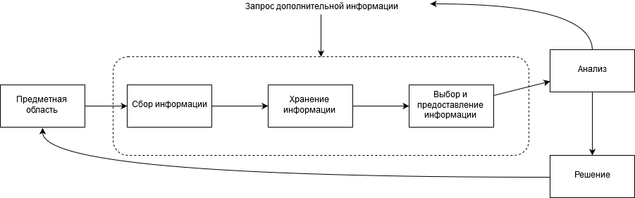

По целевому назначению можно разделить все информационные системы на:

- управляющие
- информационно-справочные
- системы поддержки принятия решений

### Появление баз данных

До появления баз данных существовала проблема представления данных: каждое приложение использовало собственный формат представления данных.

Существует два возможных варианта построения приложений, использующих данные.

1. Приложение самостоятельно определяет формат своих собственных данных, при этом структура данных описывается внутри приложения, т.е., внутри исполняемого файла. При таком варианте построения приложения нередки случаи, когда пользователи создают и используют в своих приложениях разные наборы данных, содержащие сходную информацию. Типичным примером таких приложений являлись файловые системы, используемые ранее для ведения картотек.
2. Приложение использует данные, формат которых определен ранее специальной системой или системой управления базами данных. В этом случае структура данных описывается вне программы пользователя, и от нее не зависит. При таком варианте построения приложения случаи, указанные выше, исключены, поскольку имеет место централизованное хранение данных, т.е., имеется одна база данных, с которой взаимодействуют все приложения пользователей.

**Файловая система** - это набор программ, которые выполняют для пользователей некоторые операции. 

Данные системы имели несколько проблем:

- Разделение и изоляция данных. Когда необходимые данные хранятся в разных файлах, разных отделах, крайне сложно организовать синхронную выборку даже из двух файлов, не говоря о большем количестве.
- Дублирование данных. Из-за децентрализованной работы данных, проводимых в каждом отделе, независимо от других, в файловой системе фактически происходит бесконтрольное дублирование данных. Это приводит не только к неэффективному расходованию ресурсов машины, но и может привести к нарушению целостности, когда данные в разных отделах будут противоречить друг другу.
- Зависимость от данных. Физическая структура и способ хранения записи файлов данных жестко зафиксированы в коде программ-приложений. Это означает, что изменить структуру хранимых данных достаточно сложно. Так, например, увеличение длины поля всего на один символ приведет к необходимости перекомпиляции всего приложения и созданию безошибочно работающих одноразовых конвертеров, преобразующих структуру файлов без потери данных.
- Несовместимость форматов файлов. Поскольку структура файлов определяется кодом приложения, она зависит от языка программирования. Например, файл, определенный программой, написанной на языке Паскаль, может существенно отличаться от файла, определенного программой. написанной на языке Си. Такая прямая несовместимость файлов затрудняет процесс их совместной обработки.
- Фиксированные запросы. Все требуемые запросы и отчеты должны быть созданы программистом заранее и жестко прописаны в самой программе. Это приводит к ограничению количества возможных запросов и принципиально исключает возможность создания незапланированных или произвольных запросов.

Данные ограничения - следствие двух факторов: то, что форма данных хранится в самих приложениях, и то, что помимо самих приложений иных способов доступа к данным не предусмотрено.

Для преодоления этих проблем в 1960-х годах были созданы комплексы, называемые СУБД.

**База данных** - это совокупность специальным образом организованных данных, хранимых в памяти вычислительной системы, и отображающих состояние объектов и взаимосвязей в рассматриваемой предметной области.

База данных - большое единое хранилище данных, однократно определяемое и многократно используемое.

**СУБД (система управления базами данных)** - специальное программное обеспечение, с помощью которого пользователи могут определять, создавать и поддерживать базу данных, а также осуществлять к ней контролируемый доступ.

Пример использования абстрактной СУБД:

```
БД "Аэропорт"
СОЗДАТЬ ТАБЛИЦУ
(
номер рейса	целое,
день недели текст(8),
...
)
ВЫБРАТЬ номер рейса из
ТАБЛИЦЫ расписание
ГДЕ день недели="Вт"

>>> Номер рейса | 3
```


При выполнении запроса на чтение данных, который выдается прикладной программой или непосредственно с терминала СУБД выполняет следующие действия:

1. Интерпретация запроса
2. Поиск всех описаний данных
3. Формирование команд, по которым операционная система пересылает из запоминающих устройств в буфере СУБД содержимое всех физических записей с требуемыми данными
4. Выделение из всех записей нужных данных, создание заданного вида последовательности вывода и пересылка на терминал или в рабочую область прикладной программы.

### Архитектура информационной системы.

В разное время выделялись две архитектуры:

- Файл-сервер
- Клиент-сервер

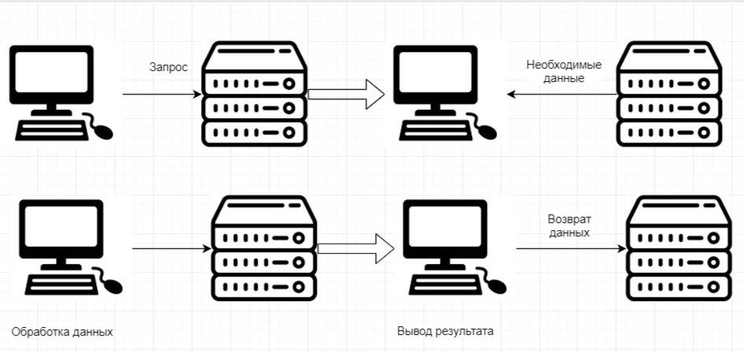

Недостатком файл-серверной архитектуры является высокая интенсивность передачи данных и как следствие большая загрузка сети, причем зачастую передаются явно избыточные данные, вне зависимости от того, сколько записей нужно пользователю из базы данных, файл передается целиком. Преимуществом данной системы можно считать отсутствие необходимости в мощном выделенном сервере.

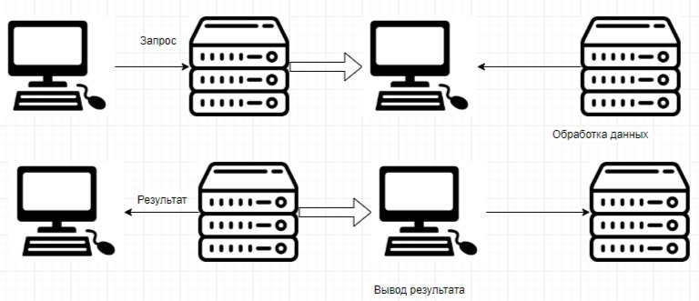

Достоинством клиент-серверной архитектуры является низкая загрузка сети, т.к. в этом случае по ней передается только запрос и результат его выполнения, а  не перекачиваются большие объемы данные, как в случае с файл-серверной архитектурой. Кроме этого, присутствует удачное сочетание централизованного хранения и обслуживания и общего доступа к корпоративной информации с индивидуальной работой пользователей над персональной информацией. Недостатком является потребность в достаточно мощном центральном сервере, который мог бы быстро обрабатывать запросы, поступающие от нескольких пользователей сразу.

## Лекция 2

### Архитектура баз данных

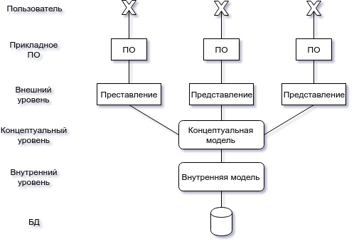

Внешний и концептуальный уровни являются логическими уровнями представления данных, а внутренний - физическим уровнем представления. Основной целью такой архитектуры является отделение пользовательского представления базы данных от ее физического представления. Для обеспечения этого вводят некоторую концептуальную модель данных, которая будет отображать для пользователей информационное содержание базы данных, ее логическую структуру, но подробности организации физического хранения данных в ней будут отсутствовать. 

Концептуальная модель описывает:

- Все сущности, их атрибуты и связи между собой
- Накладываемые на данные ограничения
- Семантическая информация о данных.

На внутреннем уровне БД может быть представлена в виде совокупности хранимых файлов, для которых известна структура хранимых записей, определены служебные поля, реализующие связи между записями, и известны методы доступа СУБД к этим записям. 

Внешний уровень является дополнительным уровнем логического представления данных, разделенным на несколько представлений. Для каждого пользователя имеется свое представление базы данных. 

Выделяют логическую и физическую независимость от данных.

- Логическая независимость от данных означает полную защищенность внешних схем от изменений, вносимых в концептуальную схему. 
- Физическая независимость от данных означает защищенность концептуальной модели от изменений, вносимых во внутреннюю модель.

### Назначение СУБД

Задачи, которые позволяет решать данное ПО:

1. Непосредственное управление данными во внешней памяти. Эта функция предполагает создание необходимых структур внешней памяти как для хранения данных, непосредственно входящих в БД, так и для служебных целей.
2. Управление буферами оперативной памяти. 
3. Управление транзакциями. **Транзакция** - это последовательность операций над базой данных, рассматриваемая СУБД как единое целое. При использовании транзакций возможны лишь два исхода: либо транзакция успешно выполняется, и СУБД фиксирует во внешней памяти изменения базы данных, произведенные этой транзакцией, либо ни одно из действий, произведенных транзакцией, никак не отражается на состоянии БД. Понятие транзакций необходимо для поддержания логической целостности базы данных. То свойство, что каждая транзакция начинается при целостном состоянии базы данных, и оставляет это состояние целостным после своего завершения, делает очень удобным использование понятия транзакции как единицы активности пользователя по отношению к базе данных. 
4. Журналирование. Одним из основных требований к СУБД является надежность хранения данных в внешней памяти. 
Под надежностью хранения понимается то, что СУБД должна быть в состоянии восстановить последнее согласованное состояние базы данных после любого программного или аппаратного сбоя. Для восстановления базы данных нужно располагать некоторой дополнительной информацией, то есть, поддержание надежности хранения данных в базе требует некоторой избыточности хранения данных, причем та часть, которая используется для восстановления, должна храниться особенно надежно. Наиболее распространенным методом  поддержания такой избыточной информации является ведение журнала изменений базы данных. **Журнал** - это особая часть базы данных, недоступная пользователям СУБД и поддерживаемая с особой тщательностью, в которую поступают записи обо всех изменениях основной части базы данных. 
5. Поддержка языков. Для работы с базами данных используются специальные языки: язык определения схем базы данных и язык манипулирования данными. Оба эти языка входят в состав SQL (SDL + DDL).
6. Поддержка словаря данных.  Словарь данных является сам по себе базой данных, и содержит т. н. метаданные, т.е., определение объектов системы, их свойств и отношений между ними для данной конкретной предметной области.

**Администратор баз данных** - это лицо, или группа лиц, отвечающие за выработку требований к базе данных, ее проектирование, реализацию, эффективное использование и сопровождение, включая управление учетными записями пользователей БД и защиту от несанкционированного доступа. Функциями администраторами являются:

1. Определение концептуальной модели
2. Определение внутренней модели
3. Взаимодействие с пользователями
4. Определение правил безопасности и целостности данных. Задача администратора БД - наиболее полно выявить все имеющиеся правила безопасности. … @todo: пропущено
   Каждое правило, налагающее некоторое ограничение на возможное состояние базы данных, называется ограничением целостности. Целостность БД не гарантирует достоверности содержащейся в ней информации, но, по крайней мере, обеспечивает правдоподобность этой информации, отвергая заведомо невозможные значения.
5. Координация действий разработчиков
6. Определение процедур резервного копирования и восстановления. В случае повреждения какой-либо части БД по той или иной причине очень важно иметь возможность восстановить данные с минимальной задержкой и наименьшим воздействием на остальную часть системы. Данные, которые не были повреждены, не должны затрагиваться процедурой восстановления. Вследствие этого администратор БД должен определить и реализовать наиболее подходящую схему восстановления потерянных данных, использующую, например, периодическую выгрузку БД на устройство резервного копирования и процедуры, при необходимости загружающие базу данных из последней копии. 
7. Выполнение работ по ведению словаря данных. 
8. Управление производительностью и реагирование на изменяющиеся потребности.

### Инфологические и даталогические аспекты проектирования БД

**Инфологический аспект** употребляется при рассмотрении вопросов, связанных со смысловым содержанием данных независимо от способов их представления в памяти системы. На этапе инфологического проектирования информационной системы выделяется часть реального мира, определяющая потребность информационной системы, т.е., ее предметная область. При этом решаются следующие вопросы: 

- о каких объектах или явлениях реального мира требуется накапливать и обрабатывать информацию в системе. 
- какие их основные характеристики и взаимосвязи между собой будут учитываться. 
- уточняются все вводимые в информационную систему понятия об объектах, явлениях, их характеристиках и взаимосвязях.

**Даталогический аспект** подразумевает рассмотрение вопросов представления данных в памяти информационной системы. При даталогическом проектировании системы исходя из возможностей имеющихся средств ввода, хранения и обработки информации разрабатываются соответствующие формы представления информации в системе, а также приводятся модели и методы представления и преобразования данных, формулируются правила их смысловой интерпретации. 

Наиболее популярной моделью, используемой для инфологического проектирования, является модель сущность - связь. 

**Модель сущность-связь** - это неформальная модель предметной области, которая работает на этапе инфологического проектирования СУБД. Она определяет сущности в информационной системе и их отношения между собой. Основным назначением этой модели является семантическое описание предметной области и представление информации для обоснования выбора видов моделей и структур данных. Понятия: сущность, атрибут, связь. Сущность - это собирательное понятие, некоторая абстракция реально существующего объекта, процесса или явления, о котором необходимо хранить информацию в системе (теоретически - любое существительное). Существует тип сущности и экземпляр сущности, по аналогии с ООП.

По типу зависимости выделяют *сильные* и *слабые* сущности. Слабая сущность - сущность, существование которой зависит от какой-то другой сущности. Сильная сущность - напротив не зависит от существования других сущностей. На диаграмме ER (Entity-Relation) будем изображать сильные сущности в прямоугольнике, а слабые - в двойном прямоугольнике.

**Атрибут** - это поименованная характеристика сущности, которая принимает значение из некоторого множества значений. Набор потенциально допустимых значений атрибута называют доменом атрибута. Простой атрибут - атрибут, состоящий из одного компонента с независимым существованием. Составной атрибут - это атрибут, состоящий из нескольких компонентов, каждый из которых характеризуется независимым существованием. Например, адрес: дом, улица, квартира, город и т. д. Принятие решения о том, будет ли, например, адрес составным атрибутом или набором простых атрибутов лежит на архитекторе базы данных и зависит от представления для пользователя. Однозначный атрибут - атрибут, который для данной конкретной сущности может принимать только одно значение. Многозначный атрибут - атрибут, который для конкретной сущности может принимать несколько значений (например, несколько телефонов). Производный атрибут - атрибут, который может принимать значение, производное от значения связанного с ним атрибута (например, возраст, который зависит от даты рождения).

**Ключ** - элемент данных, позволяющих уникально идентифицировать отдельные экземпляры некоторой сущности. Потенциальный ключ - это атрибут, или набор атрибутов, который уникально идентифицирует отдельные экземпляры сущности. Составной ключ - это потенциальный ключ, который состоит из двух или более атрибутов. Например, рекламное объявление - издание, в котором оно помещено, дата выхода газеты и стоимость. Первичный ключ - это потенциальный ключ, который выбран в качестве первичного ключа.

@todo картинка с доски

## Лекция 3

**Связь** - это осмысленная ассоциация между двумя или более сущностями. В модели связи выступают в качестве средства, с помощью которого представляются отношения между сущностями, имеющими место в рассматриваемой предметной области.

Наличие связей обеспечивает сложность инфологических моделей.
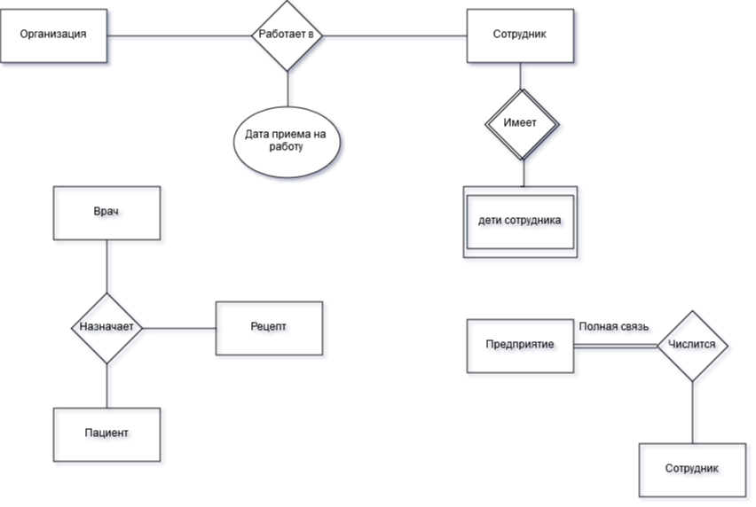

Степень участия сущности в связи определяет зависит ли существование некоторой сущности от участия в связи некоторой другой сущности. Степень участия является полной, если для существования некоторой сущности требуется участие другой сущности, связанной с ней определенным отношением. В противном случае связь является частичной.

Показатель кардинальности связи описывает количество возможных связей для каждой из сущностей - участниц.

Могут быть показатели:

- 1:1
- 1:M
- M:N

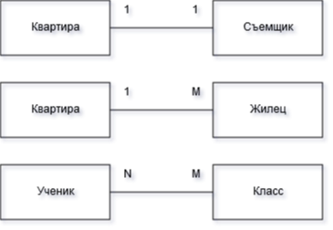

#### Методика построения:

1. Выбор границ локального построения. Определение задач, соответствующих некоторому кругу потребностей пользователя. Необходимо с одной стороны избежать дробления данных, а с другой стороны не допустить чрезмерного раздувания предметной области для пользователя.

2. Формулирование сущности. Пример различных вариантов формулирования сущности:
   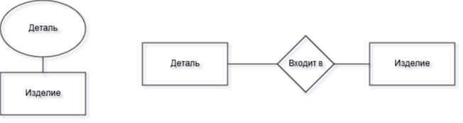
   Желательно рассмотреть все варианты и выбрать тот, в котором будет легче получать не только объекты, но и отдельные части информации.
   Пример улучшения схемы:
   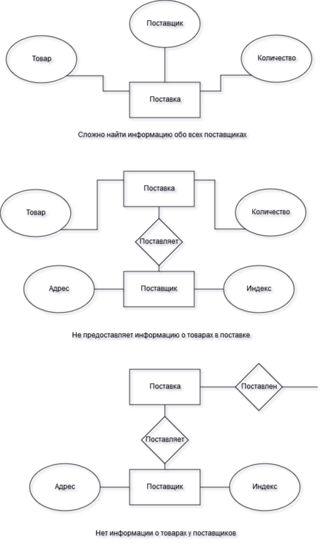
   
3. Выбор идентифицирующего атрибута. Для каждой выделенной сущности нужно указать идентификатор, служащий для однозначного распознавания отдельных экземпляров сущности. Возможны такие случаи, когда экземпляры сущности могут отличаться не только по атрибутам, но и по связям с другими сущностями.

4. Назначение сущностям отрицательных атрибутов. Спецификация каждого атрибута будет включать в себя не только семантическое описание, но и описание домена (возможного набора значений)

5. Спецификация связей. Связь может быть не только между сущностями, но и между атрибутами. На данном шаге выявляются атрибуты, находящиеся в транзитивном отношении. Говорят, что три атрибута A1, A2, A3 находятся в транзитивном отношении, когда A1 однозначно определяет A2, а A2 однозначно определяет A3. 

   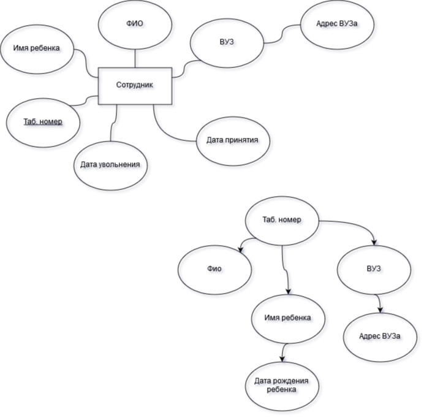
   Между атрибутами этой сущности имеют место определенные связи. Так как все атрибуты описывают одну и ту же сущность "сотрудник", которая имеет ключевой атрибут "табельный номер", то все атрибуты имеют зависимость от данного атрибута. Это означает, что при описании конкретных экземпляров сущности "сотрудник" описательные атрибуты не могут принимать произвольные значения, а зависят от ключевого атрибута. Кроме этого, между атрибутами наблюдается ряд транзитивных зависимостей. При моделировании сущностей надо всегда стремиться к случаю, когда все описательные атрибуты зависят лишь от ключевого, т.е., избегать транзитивных зависимостей.
   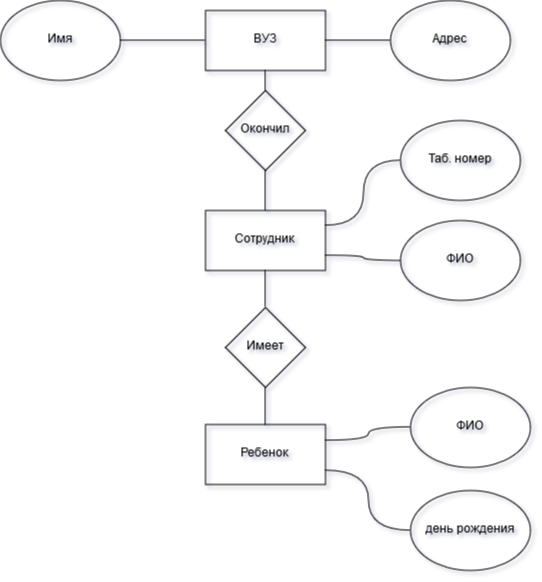

6. Объединение моделей локальных представлений. При объединении локальных представлений используется три приема:

   - Идентичность. Два и более элементов идентичны, если имеют одинаковое семантическое (смысловое) значение.
   - Агрегация. Позволяет рассматривать связь между элементами модели как новый элемент. При объединении локальных представлений агрегация встречается в трех формах:
     1. В одном представлении агрегатный объект определен как единое целое, а во втором рассматриваются его составные части.
     2. Агрегатный объект как единое целое не определен ни в одном из представлений, но в обоих представлениях рассматриваются его составные части.
     3. Один и тот же агрегатный элемент рассматривается в обоих представлениях, но составные части его различаются.
        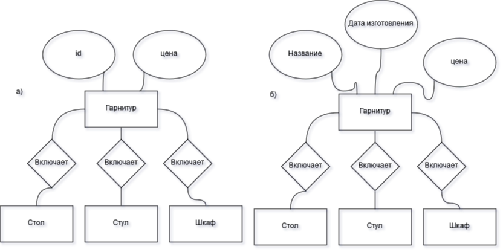
   - Обобщение. Обобщением называется абстракция данных, позволяющая трактовать класс различных подобных типов объектов как один поименованный обобщенный объект. В обобщении подчеркивается общая природа объектов. Использование обобщения позволяет строить многоуровневые иерархии элементов, в которых элементы низлежащего уровня наследуют все характеристики своего предшественника. При этом потомок может иметь новые черты, не принадлежащие предшественнику.
     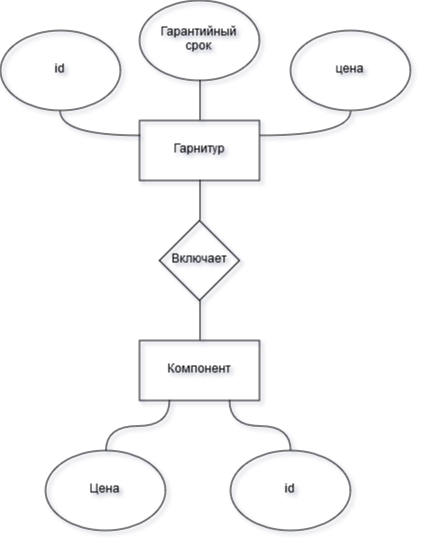

   Методологии разработки баз данных. С использованием систем CASE Разработка системы представляется в виде последовательных, четко определенных этапов:

   - Анализ требований
   - Проектирование
   - Реализация и тестирование
   - Внедрение
   - Сопровождение

Назначение CASE-систем - поддержка всех этапов жизненного цикла информационной системы, начиная с анализа предметной области, до получения и сопровождения готового программного продукта. Поддержка репозитория, хранящего спецификации проекта информационной системы на всех этапах ее разработки. Обеспечение возможности одновременной работы с репозиторием многих разработчиков, автоматизация различных стандартных действий по проектированию и реализации информационных систем. Как правило, CASE-системы поддерживают следующие этапы процесса разработки информационных систем: 

1. Моделирование и анализ действий пользователя в рамках предметной области. Здесь осуществляется функциональная декомпозиция, определение иерархий функций, построение диаграмм потоков данных. Перечень информационных объектов, которыми манипулируют функции, передается на следующий этап проектирования.
2. Концептуальное моделирование - создание диаграммы сущность-связь на основе перечня объектов, полученного на предыдущем этапе. 
3. Преобразование диаграммы сущность-связь в физическую схему базы данных, учитывающую особенности выбранной СУБД.
4. Автоматическая генерация SQL-сценария создания базы данных. Результатом данного этапа является набор SQL-операторов, описывающих создание схемы базы данных с учетом особенностей выбранной СУБД.
5. Некоторые CASE-системы выполняют генерацию прототипов программных модулей прикладного ПО, создание экранных форм и отчетов. 