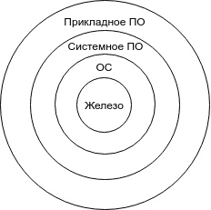

## Лекция 1

### Процессы и потоки

Процесс запускается когда запускается приложение. Ему принадлежит какая-то область памяти. Потоки же делят эту область памяти. Главный ресурс для потоков - время процессора. В ОС Windows стандартно квант времени равен 20 мс. Таким образом, в секунду одно ядро может обслужить до 50 потоков. Все остальные потоки находятся в состоянии ожидания. 

Выделяются системные и пользовательские процессы и потоки. При этом все потоки находятся в очереди, и очередность выполнения определяется приоритетом процесса. 

Операционная система является арбитром для потоков, разделяя процессорное время, память и т. д. между потоками и процессами.

### Подсистема управления памятью

С точки зрения строения памяти могут быть два вида памяти:

- Сегментная - в виде двух адресов
- Плоская - один адрес

В современных системах память имеет плоскую модель, в которой для каждого исполняемого файла адреса начинаются с виртуального нуля - начала памяти.

Память подгружается страницами; размер страницы - 4 Кб.

### Файловые системы

Минимальный размер кластера равен размеру сектора, т.е., 512 байт.

### Вопросы из экзаменационных

1. Определение ОС.
   ОС - это программное обеспечение, которое с одной стороны, выступает как интерфейс между пользователем и аппаратным обеспечением компьютера, а с другой стороны - предназначено для эффективного использования ресурсов этого компьютера и организации на нем надежных вычислений. 
   
Первые три поколения компьютеров не имели ОС как таковой, однако 2-3 поколение обзавелись системами пакетного выполнения - автоматизированной загрузки программ и их выполнения.
В ОС для четвертого поколения компьютеров (1965 год) было реализовано: мультипрограммирование, мультипроцессирование, поддержка многотерминального многопользовательского режима, виртуальная память, файловая система, распределение доступа и сетевая работа. Под мультипрограммированием понимается возможность выполнения на одном компьютере нескольких задач. Под мультипроцессированием подразумевается поддержка нескольких процессоров. Распределение доступа - введение системы полномочий. 
2. 