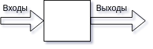
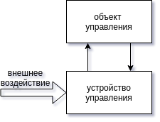

### Лекция 1 

**Автомат** - устройство выполняющее работу без участия человека.

**Цифровой автомат** - устройство обрабатывающее цифровую информацию.

Автомат работает в *реальном времени*.

Любую техническую систему можно представить таким способом

#### Процесс проектирования автоматов.

**Проектирование** - процесс получения проектной документации.

2 этапа проектирования

* начальный (описание устройства)
* заключительный (описание создания устройства)

На этапе *структуного* проектирования определяется архитектура устройства и его компоненты,алгоритмы функционирования отдельных компонент и устройства в целом, и в зависимости от того какие задачи преобладают на этом этапе. Этап называют архитектурным или алгоритмичиским

На этапе *логического* проектирования определяется логическая структура устройства, определяется какие логические элементы, и функции требуется использовать для функционирования устройства, так же определяются связи между элементами. При этом не обращают внимание на то какими реальными элементами могут быть реализованы те которые выбраны на этапе логического проектирования.

На этапе *технического* проектирования определяются какие реальные элементы требуется использовать для создаия устройства. Определяется их компоновка и связи.

При проектировании используются *модели* цифровых устройств.

При проектировании цифровых автоматов используются структурные модели (прим. логическая схема устройства представляющая собой ориентированный граф в которой вершины соответствуют логическим элементам а дуги связям между элементами) или же функциональные модели(показывает что устройство делает, как преобразуются входные данные в выходные, не описывая внутренние процессы преобразования).

На этапе логического проектирования решаются 3 основные задачи:
* задача синтеза
* задача анализа
* задача тестирования

*Задача синтеза* заключается в построении структурной модели устройства по заданной функциональной модели.

>Из математического описания модели строится логическая схема устройства.

Характеристики логической схемы:
* сложность схемы (определяется кол-вом логических элементов, связей, входов в элементы)
* быстродействие схемы (время преобразования входных данных в выходные)
* тестопригодность схемы (сложность диагностики неисправностей)

*Задача анализа* противоположна задаче синтеза, построение функциональной модели по заданной структурной.

При *тестировании* выполняется определенный эксперимент с устройством, проверяются входные данные и выходные данные, и выводится заключение.
При *проверочном тестирование* заключением будет исправность устройства.
При *диагностическом тестировании* заключением будет указание конкретной неисправности.

Цифровые автоматы можно разделить на 2 группы:
1. Комбинационные схемы или автомат без памяти (выход однозначно определяется входом)
    1. Простые (1 выход) (функциональная модель - *булева функция*)
    2. Сложные (больше 1 выхода) (функциональная модель - *система булевых функций*)
2. Автомат с памятью (выход определяется не только текущими значениями входа, но и предыдущими значениями)

**Функция** - частный случай соответствия.
$$X \rightarrow Y$$
X - область отправления. 
Y - область прибытия.
Определение булевой функции 
$$ M = {0,1}$$
$$ X = M^n$$
$$ Y = M$$

| $$x_1$$ | $$x_2$$ | $$x_3$$ |      |
| ------- | ------- | ------- | ---- |
| 0       | 0       | 0       | 1    |
| 0       | 0       | 1       | 1    |
| 0       | 1       | 0       | 0    |
| 0       | 1       | 1       | 1    |
| 1       | 0       | 0       | 0    |
| 1       | 0       | 1       | 0    |
| 1       | 1       | 0       | 0    |
| 1       | 1       | 1       | 1    |

Описание булевых функций

| $$x_1$$ | 0    | 0    | 1    | 1    ||
| ------- | ---- | ---- | ---- | ---- | ------- |
| $$x_2$$ | 0    | 1    | 0    | 1    ||
| ------- | ---- | ---- | ---- | ---- | ------- |
| $$f_0$$ | 0    | 0    | 0    | 0    | константа 0 |
| $$f_1$$ | 0 | 0 | 0 | 1 |конъюнкция,$$\and$$, умножение|
| $$f_2$$ | 0 | 0 | 1 | 0 |запрет первого аргумента $$x_1 \leftarrow x_2$$|
| $$f_3$$ | 0   | 0    | 1   | 1   | повторение первого аргумента $$x_1$$ |
| $$f_4$$ | 0    | 1   | 0    | 0  | запрет второго аргумента $$x_2 \leftarrow x_1$$ |
| $$f_5$$ | 0    | 1   | 0    | 1   | повторение второго аргумента $$x_2$$ |
| $$f_6$$ | 0    | 1   | 1   | 0    | сложение по модулю 2, $$\oplus$$, неравнозначность |
| $$f_7$$ | 0    | 1   | 1   | 1   | дизъюнкция,$$\or$$,сложение |
| $$f_8$$ | 1   | 0    | 0    | 0    | стрелка Пирса, $$x_1 \downarrow x_2$$ |
| $$f_9$$ | 1   | 0    | 0    | 1   | эквивалентность, $$\equiv$$ |
| $$f_{10}$$ | 1   | 0    | 1   | 0    | отрицание второго аргумента $$\lnot x_2$$ |
| $$f_{11}$$ | 1   | 0    | 1   | 1   | импликация $$x_1 \rightarrow x_2$$ |
| $$f_{12}$$ | 1   | 1   | 0    | 0    | отрицание первого аргумента $$\lnot x_1$$ |
| $$f_{13}$$ | 1   | 1   | 0    | 1   | импликация $$x_2 \rightarrow x_1$$ |
| $$f_{14}$$ | 1   | 1   | 1   | 0  | штрих Шеффера $$x_1 | x_2$$ |
| $$f_{15}$$ | 1   | 1   | 1   | 1   | константа 1 |

## Лекция 2

Элементарные булевы функции можно использовать для составления элементарных функциональных моделей. 

**Свойства булевых функций:**

* *Сохранение нуля*. Функция обладает свойством сохранения нуля, если её значение на нулевом наборе аргументов равна 0. 

  > Пример функции: конъюнкция, дизъюнкция. 

* *Сохранение единицы*. Функция сохраняет единицу, если ее значение на единичном наборе равно 1.

* *Самодвойственность.* Функция обладает свойством самодвойственности, если на противоположных наборах аргументов значение функции противоположное.

* *Монотонность.* Функциия обладает свойством монотонности, если при возрастании наборов аргументов значение функции не убывает.

  > Наборы аргументов (0,1) и (1,0) несравнимы.

* *Линейность*. Функция обладает свойством линейности. если ее можно представить ввиде:
   $$
   a_2x_2\oplus a_1x_1 \oplus a_0.
   $$
   

   
   Если с помощью набора функций можно выразить любую другую функцию, то этот набор называется функционально полным.

Для того чтобы набор функций был функционально полным, набор должен содержать:

* хотябы одну не сохраняющую нуль.
* хотябы одну функцию не сохраняющую единицу.
* хотябы одну не линейную функцию.
* хотябы одну не монотонную функцию.

| Функция  | 1 | 2 | 3 | 4 | 5 |
| --- | --- | --- | --- | --- | --- |
| $$f_0$$ | | $$\times$$ | $$\times$$ | | $$\times$$ |
| $$f_1$$ | | | $$\times$$ | | |
| $$f_2$$ | | $$\times$$ | $$\times$$ | $$\times$$ | $$\times$$ |
| $$f_3$$ | | | | | |
| $$f_6$$ | | $$\times$$ | $$\times$$ | $$\times$$ | |
| $$f_7$$ | | | $$\times$$ | | $$\times$$ |
| $$f_8$$ | $$\times$$ | $$\times$$ | $$\times$$ | $$\times$$ | $$\times$$ |
| $$f_9$$ | $$\times$$ | | $$\times$$ | $$\times$$ | |
| $$f_{10}$$ | $$\times$$ | $$\times$$ | | $$\times$$ | |
| $$f_{11}$$ | $$\times$$ | | $$\times$$ | $$\times$$ | $$\times$$ |
| $$f_{14}$$ | $$\times$$ | $$\times$$ | $$\times$$ | $$\times$$ | $$\times$$ |
| $$f_{15}$$ | $$\times$$ | | $$\times$$ | |  |

Существует основной набор логических функций: конъюнкция, дизъюнкция, отрицание.

Набор из конъюнкции и отрицания или из дизъюнкции и отрицая функционально полный.
$$
\and, \or, \lnot - \text{булева алгебра.}
$$

$$
\oplus, \and, 1 - \text{алгебра Жегалкина.}
$$

ИЛИ-НЕ
$$
\lnot x_1 = x_1 \downarrow x_1
$$

$$
x_1\downarrow x_2 = \lnot(x_1\or x_2)
$$

$$
x_1\or x_2 = \lnot(x_1 \downarrow x_2) = (x_1\downarrow x_2) \downarrow (x_1\downarrow x_2)
$$

$$
x_1 \and x_2 = \lnot(\lnot(x_1\and x_2))=(x_1\downarrow x_1)\downarrow(x_2\downarrow x_2)
$$

И-НЕ
$$
\lnot x_1 = x_1 | x_1
$$

$$
x_1 | x_2 = \lnot(x_1\and x_2)
$$

$$
x_1 \and x_2 =\lnot(x_1|x_2)=(x_1|x_2)|(x_1|x_2)
$$

$$
x_1 \or x_2 = \lnot(\lnot(x_1\or x_2))=(x_1| x_1)|(x_2|x_2)
$$

Рассмотрим пример получение функциональной модели по содержательному описанию устройства.

РИСУНОК УСТРОЙСТВА.

1. На выходе должна быть единица, если на входе каждый следующий разряд не меньше предыдущего.

2. Устройство должно выдавать единицу если на входе кол-во единиц четно.

Мультиплексор - устройство с 2 группами входов

РИСУНОК УСТРОЙСТВА.

## Лекция 3

### Формы записи функциональных моделей:

1. Дизъюнктивная нормальная форма.
   Обозначим переменную $x_1$. В конъюнкцию может входить переменная $x1$ или ее отрицание $\neg{x_1}$. Конъюнкция нескольких переменных или отрицаний называется **конъюнктивный терм**. К.Т., который содержит все переменные в функции, называется **коституэнтой единицы**. Булева функция (не любая, но некоторые частные случаи) может быть представлена конституэнтой единицы. Особенность этой функции в том, что она принимает единичное значение только на одном наборе аргументов. Этот набор можно получить, присвоив переменным без отрицания 1, а с отрицанием - 0.  Дизъюнкция произвольного количества конституэнт называется **совершенной дизъюнктивной нормальной формой (СДНФ)**. СДНФ легко получить из таблицы истинности: нужно выбрать те наборы, на которых функция принимает единичное значение; для каждого такого набора найти конституэнту единицы; и записать дизъюнкцию этих конституэнт. Получить СДНФ можно не только из таблицы истинности, но и из других формул, которые не являются СДНФ. Если конституэнты заменить на произвольные конъюнктивные термы, то получится дизъюнктивная нормальная форма (ДНФ). Из нее можно получить СДНФ, заменив термы на пару конституэнт (с отрицанием переменной и без отрицания). Также можно преобразовать любую формулу в ДНФ, выразив функции через функциональную группу конъюнкции, отрицания, дизъюнкции, раскрывая скобки и применяя законы де Моргана. Другой способ получить ДНФ - использовать разложение Шеннона.
   Разложение Шеннона: $$f(x_1, x_2, x_3) = x_1f(1,x_2,x_3)\or\neg{x_1}f(0,x_2,x_3)$$ последовательно по $x_1, x_2, x_3$ или сразу по всем трем переменным: $$f(x_1,x_2,x_3)=x_1x_2x_3f(1,1,1)\or x_1x_2\neg{x_3}f(1,1,0)\or\dots$$

2. Если в конъюнктивном терме заменить знак конъюнкции на знак дизъюнкции, получится дизъюнктивный терм $x_1\or x_2\or x_5$. Д.Т., который содержит все аргументы, называется **конституэнтой нуля**. Конституэнта 0 принимает нулевое значение на единственном наборе элементов. Аналогично СДНФ, можно получить **совершенную конъюнктивную нормальную форму** из таблицы истинности.

3. Совершенная полиномиальная нормальная форма представляет собой сложение по модулю два конституэнт единицы. Данную замену можно осуществить, т.к. по определению две различные конституэнты не принимают значение 1 на одном и том же наборе. 

4. Далее заменяем отрицание на сложение по модулю 2 с единицей и раскрываем скобки. В итоге получим сумму конъюнкций. Конъюнкция может иметь произвольное количество аргументов, и в качестве слагаемого может быть константа 0 или 1. Константы 0 отбрасываются, сложение одинаковых аргументов обращается в 0. Результатом будет **полином Жегалкина**. Для каждой функции имеется один полином Жегалкина, если не учитывать порядок слагаемых и порядок внутри слагаемых.

Одно из назначений булевых функций - использование функциональной модели как исходных данных для решения задачи синтеза, т.е., построения схемы устройства. При решении этой задачи желательно иметь более простую функциональную модель (ту, по которой удобнее решать задачу синтеза).  Для получения более простой ДНФ используются методы минимизации. Для любой функции можно найти одну или несколько минимальных ДНФ. Это ДНФ, которая содержит количество операций не большее, чем любая другая ДНФ, представляющая ту же самую функцию. 

Возьмем функцию от трех аргументов, заданную таблицей истинности:

| $x_1$ | $x_2$ | $x_3$ | $f$  | $g_1$ | $g_2$ | $g_3$ | $g_4$ | $g_5$ | $g_6$ | $g_7$ |
| ----- | ----- | ----- | ---- | ----- | ----- | ----- | ----- | ----- | ----- | ----- |
| 0     | 0     | 0     | 0    | 0     | 0     | 0     | 0     | 0     | 0     | 0     |
| 0     | 0     | 1     | 0    | 0     | 0     | 0     | 0     | 0     | 0     | 0     |
| 0     | 1     | 0     | 0    | 0     | 0     | 0     | 0     | 0     | 0     | 0     |
| 0     | 1     | 1     | 1    | 1     | 0     | 0     | 0     | 1     | 0     | 1     |
| 1     | 0     | 0     | 0    | 0     | 0     | 0     | 0     | 0     | 0     | 0     |
| 1     | 0     | 1     | 0    | 0     | 0     | 0     | 0     | 0     | 0     | 0     |
| 1     | 1     | 0     | 1    | 0     | 1     | 0     | 0     | 0     | 0     | 0     |
| 1     | 1     | 0     | 1    | 0     | 0     | 1     | 0     | 0     | 1     | 1     |
| 1     | 1     | 1     | 1    | 0     | 0     | 0     | 1     | 1     | 1     | 1     |

И найдем множество других функций таких, что если на некотором наборе функция принимает единичное значение, исходная функция принимает также единичное значение.

Функции $g_1\dots g_7$ называются импликантами функции $f$.

$$
g_1=\neg{x_1}x_2x_3 \\

g_2=x_1x_2\neg{x_3} \\

g_3=\neg{x_1}x_2x_3\or x_1x_2\neg{x_3} \\

g_4=x_1x_2x_3 \\

g_5=\neg{x_1}x_2x_3\or x_1x_2x_3=x_2x_3 \\

g_6=x_1x_2\neg{x_3}\or x_1x_2x_3=x_1x_2 \\

g_7=f
$$

Простая импликанта - импликанта, не содержащая в себе конъюнктивных термов и других импликант. Дизъюнкция всех простых импликант представляет собой сокращенную нормальную форму. Если функция задана в СДНФ, то найти все простые импликанты можно по методу Квайна - МакКласки.

| 0    | 1    | 2          | 3    |
| ---- | ---- | ---------- | ---- |
|      |      | 011+; 110+ | 111+ |
|      |      | -11; 11-   |      |

Склеиваем импликанты в соседних столбцах таблицы (можно использовать одну импликанту несколько раз) до тех пор, пока склеивание не станет невозможным. Те импликанты. которые остались не склеенными, не входят в число простых импликант.

Среди простых импликант могут быть лишние - удаление которых из формулы не изменяет значения формулы. Чтобы найти их, построим матрицу Квайна.

Строки в матрице соответствуют простым импликантам, а столбцы - конституэнтам единицы.
Ставим в клетке +, если соответствующая импликанта входит в конституэнту.

|      | 011  | 110  | 111  |
| ---- | ---- | ---- | ---- |
| -11  | +    |      | +    |
| 11-  |      | +    | +    |

Необходимо выбрать из всех импликант такие, что в каждом из столбцов будет хотя бы один плюс, и при исключении еще одной импликанты функция меняется. Таких форм - тупиковых форм - может быть несколько. Тупиковая форма, в которой количество операций не больше, чем в других формах, называется минимальной. Минимальных форм может быть несколько.

Для поиска тупиковых форм сначала ищется ядро Квайна: просматриваем столбцы, и если в столбце только один крестик, то соотв. импликанта входит во все тупиковые формы, и удалить ее нельзя. 
После того, как нашли ядро Квайна - ищем строки, которые покрывают наибольшее количество непокрытых столбцов, и добавляем ее к ядру Квайна. Другой вариант - получить все тупиковые формы, используя метод Петрика. 

Представим матрицу в виде булевой функции: 1-я строка $x_1$, 2-я $x_2$, и составляем функцию, описывающую таблицу. Запишем: нужно покрыть первый столбец, второй столбец и третий столбец. Для этого можно взять $x_1x_2(x_1\or x_2) = x_1x_2\or x_1x_2 = x_1x_2$. К полученной форме применяем опять метод поиска минимальной формы. На практике имеет смысл найти ядро Квайна, вычеркнуть столбцы и строки ядра, а затем воспользоваться методом Петрика.

По аналогии с получением минимальной формы ДНФ, можно получить минимальную КНФ.

Сокращенную и минимальную ДНФ можно получать из других форм и другими методами. Можно использовать метод Блэка-Порецкого, основанный на операции обобщенного склеивания.

$$Ax\or B\neg{x} = Ax\or B\neg{x}\or AB$$

Выполняем склеивание по этой формуле до тех пор, пока это возможно, а затем выполняем поглощения. Полученный результат будет минимально возможным.

$$\neg{x_1}\neg{x_2}\or x_1\neg{x_2}\neg{x_3}\or x_1x_2 = \neg{x_1}\neg{x_2}\or x_1\neg{x_2}\neg{x_3}\or \neg{x_2}\neg{x_3}$$ и исключаем второй дизъюнкт. Далее $$=\neg{x_1}\neg{x_2}\or x_1x_2$$

Следующий способ позволяет получить сокращенную ДНФ из произвольной КНФ: метод Нельсона.

Метод заключается в следующем: раскрываем все скобки, и выполняем поглощения. 

##  Лекция 4

Если задана функция $f = x_1\neg x_2 x_6 \or x_1x_2x_5\neg x_6 \or x_1\neg x_2 x_4 \neg x_5 \or x_1 \neg x_2 x_3 x_5$

@todo добавить схему

В этой схеме можно выделить три уровня: 1 уровень - НЕ, 2 уровень - И, 3 уровень - ИЛИ. Максимально сигнал проходит три элемента. Т.о., время прохождения сигнала будет пропорционально количеству уровней. Обратная величина - быстродействие системы. То есть, быстродействие будет тем больше, чем меньше уровней. 

Сложность же можно оценить по количеству элементов. Элементов в схеме 8. Однако сложность элементов неодинакова. Можно каждому элементу назначить некоторый "вес" сложности.
Либо же можно оценить по суммарному количеству входов - оценка Квайна. В данной схеме оценка Квайна - 22.

Существуют также инверсные входы элементов - при их использовании не используют элементы НЕ, а подключают выход к инверсному входу.

Когда рассматривается реальная схема, может понадобиться заменить элементы с несколькими входами на несколько элементов с двумя входами. При этом могут образоваться группы элементов с одинаковыми функциями, лишние из которых стоит исключить. Для того, чтобы выполнить такое преобразование, используется **факторизационный метод**.
Булева функция представляется  в следующем виде: в таблице столбцы соответствуют аргументам булевых функций, при этом включаются как прямые аргументы, так и их отрицания. Строки соответствуют конъюнктивным термам.

|       | $x_1$ | $x_2$ | $\neg x_2$ | $x_3$ | $x_4$ | $x_5$ | $\neg x_5$ | $x_6$ | $\neg x_6$ |
| ----- | ----- | ----- | ---------- | ----- | ----- | ----- | ---------- | ----- | ---------- |
| $u_1$ | 1     | 0     | 1          | 0     | 0     | 0     | 0          | 1     | 0          |
| $u_2$ | 1     | 1     | 0          | 0     | 0     | 1     | 0          | 0     | 1          |
| $u_3$ | 1     | 0     | 1          | 0     | 1     | 0     | 1          | 0     | 0          |
| $u_4$ | 1     | 0     | 1          | 1     | 0     | 1     | 0          | 0     | 0          |

Таблица показывает, что чтобы получить u_1, надо подать на вход элемента x_1, \neg x_2, x_6, и т. д.. 

Добавим ограничения на количество входов - сначала 2, затем 3.

Способ заключается в нахождении миноров: $M_{i, j} = 1. i\in X, j\in Y$. Находя минор, добавляем элемент, соотвествующий минору в столбец. Минор вычеркивается, а соотв. столбец заполняем единицами. Так, каждый раз мощность множества будет уменьшаться на $Y$, при этом в строках будет уменьшаться количество единиц. А это значит, что для реализации терма понадобится меньше входов.

На каждом шаге требуется выбрать наибольший возможный минор. Мощность минора оценивается как $|X|*|Y| - |Y|$. Из этого можно заключить, что чем больше в миноре столбцов, тем хуже, а чем больше единиц, тем лучше.
Возьмем в качестве минора набор $X = x_1, \neg x_2; Y = u_1, u_3, u_4$ или $X = x_1, x_5; Y = u_2, u_4$. Метрика первого минора 2 * 3 - 3 = 3; второго - 2*2-2 = 2. Выберем первый минор.

|       | $x_1$ | $x_2$ | $\neg x_2$ | $x_3$ | $x_4$ | $x_5$ | $\neg x_5$ | $x_6$ | $\neg x_6$ | $z_1$ |
| ----- | ----- | ----- | ---------- | ----- | ----- | ----- | ---------- | ----- | ---------- | ----- |
| $u_1$ | ~~1~~ | 0     | ~~1~~      | 0     | 0     | 0     | 0          | 1     | 0          | 1     |
| $u_2$ | 1     | 1     | 0          | 0     | 0     | 1     | 0          | 0     | 1          | 0     |
| $u_3$ | ~~1~~ | 0     | ~~1~~      | 0     | 1     | 0     | 1          | 0     | 0          | 1     |
| $u_4$ | ~~1~~ | 0     | ~~1~~      | 1     | 0     | 1     | 0          | 0     | 0          | 1     |
| $z_1$   | 1     | 0     | 1          | 0     | 0     | 0     | 0          | 0     | 0          | 0     |

Для того, чтобы получить сигнал $z_1$, нужно подать $x_1, \neg x_2$. При этом этот сигнал подается на $u_1, u_3, u_4$.

Смотрим на строки. В некоторых строках все еще больше двух единиц. Значит, необходимо добавить строку и столбец, чтобы избавиться от них.

|       | $x_1$ | $x_2$ | $\neg x_2$ | $x_3$ | $x_4$ | $x_5$ | $\neg x_5$ | $x_6$ | $\neg x_6$ | $z_1$ | $z_2$ | $z_3$ | $z_4$ | $z_5$ |
| ----- | ----- | ----- | ---------- | ----- | ----- | ----- | ---------- | ----- | ---------- | ----- | ----- | ----- | ----- | ----- |
| $u_1$ | ~~1~~ | 0     | ~~1~~      | 0     | 0     | 0     | 0          | 1     | 0          | 1     | 0    | 0    | 0    | 0    |
| $u_2$ | 1     | 1     | 0          | 0     | 0     | 1     | 0          | 0     | 1          | 0     | 1    | 1    | 0    | 0    |
| $u_3$ | ~~1~~ | 0     | ~~1~~      | 0     | 1     | 0     | 1          | 0     | 0          | 1     | 0    | 0    | 1    | 0    |
| $u_4$ | ~~1~~ | 0     | ~~1~~      | 1     | 0     | 1     | 0          | 0     | 0          | 1     | 0    | 0    | 0    | 1    |
| $z_1$   | 1     | 0     | 1          | 0     | 0     | 0     | 0          | 0     | 0          | 0     | 0    | 0    | 0    | 0    |
| $z_2$ | 1 | 1 | 0 | 0 | 0 | 0 | 0 | 0 | 0 | 0 | 0 | 0 | 0 | 0 |
| $z_3$ | 0 | 0 | 0 | 0 | 0 | 1 | 0 | 0 | 1 | 0 | 0 | 0 | 0 | 0 |
| $z_4$ | 0 | 0 | 0 | 0 | 1 | 0 | 1 | 0 | 0 | 0 | 0 | 0 | 0 | 0 |
| $z_5$ | 0 | 0 | 0 | 1 | 0 | 1 | 0 | 0 | 0 | 0 | 0 | 0 | 0 | 0 |

@todo добавить еще схему

Далее делаем то же самое для элементов И, но теперь столбцы - это $u_1\ldots u_4$, а начальная строка - $f$ (1 1 1 1).

Для оценки быстродействия мы можем определить глубину схемы.

Для написания программы, проверяющей схему, можно провести топологическую сортировку по уровням элементов. Элементы описываются в порядке неуменьшения уровня. Нулевые уровни - отрицание. Далее z1:=x1&!x2. z2:=x1&x2. u1:=x6&z1…… f:=v1|v2. 

## Лекция 5

Для построения двухуровневой схемы в монофункциональном базисе (И-НЕ или ИЛИ-НЕ) 

Возьмем функцию, тупиковая форма: $x_1\neg x_2 x_6 \or x_1 x_2 x_5 \neg x_6 \or x_1\neg x_2 x_4 \neg x_5$

Будем работать в базисе и-не.

Сначала заменим или на и с помощью закона де Моргана.

 $\neg(\neg(x_1\neg x_2 x_6 \or x_1 x_2 x_5 \neg x_6 \or x_1\neg x_2 x_4 \neg x_5))$

$\neg(\neg(x_1\neg x_2 x_6) \neg(x_1 x_2 x_5 \neg x_6) \neg (x_1\neg x_2 x_4 \neg x_5))$

каждую из внутренних скобок можно реализовать используя базис и-не. 

@todo схема 1

$x_1\neg x_2 x_6 \or x_1 x_2 x_5 \neg x_6 \or x_1\neg x_2 x_4 \neg x_5$

Заменим И на ИЛИ с помощью де Моргана

Поставим отрицание над каждым конъюнктивным термом.

$\neg(\neg(x_1\neg x_2 x_6))\neg(\neg(x_1 x_2 x_5 \neg x_6)) \neg (\neg(x_1\neg x_2 x_4 \neg x_5))$

$\neg(\neg x_1\or x_2\or \neg x_6))\or \neg(\neg x_1 \or \neg x_2 \or \neg x_5 \or x_6) \or \neg(\neg x_1\or x_2\or \neg x_4 \or x_5))$

Чтобы была возможность реализовать функцию на ИЛИ-НЕ, добавим отрицание

$\neg (\neg(\neg x_1\or x_2\or \neg x_6))\or \neg(\neg x_1 \or \neg x_2 \or \neg x_5 \or x_6) \or \neg(\neg x_1\or x_2\or \neg x_4 \or x_5)))$

Эта схема даст отрицательный результат. Чтобы избавиться от отрицания, добавим элемент, на вход которого подается паралллельно два одинаковых

@todo схема 2

Что произойдет, если необходимо ограничить количество входов?

Можно сгруппировать элементы следующим образом:

$\neg(\neg\neg(x_1\neg x_2)x_6) \neg(\neg\neg (x_1x_2)\neg\neg(x_5\neg x_6)) \neg(\neg\neg(x_1\neg x_2)\neg\neg (x_4 x_5)))$

=

$\neg(\neg\neg(\neg\neg(x_1\neg x_2)x_6) \neg(\neg\neg (x_1x_2)\neg\neg(x_5\neg x_6))) \neg(\neg\neg(x_1\neg x_2)\neg\neg (x_4 x_5)))$

Перепишем используя обозначение штрих Шеффера

$\neg((\neg(x_1|\neg x_2) | x_6) | (\neg(x_1|x_2) | \neg(x_5|\neg x_6))) | (\neg(x_1|\neg x_2) | \neg(x_4 | \neg x_5)))$

@todo схема 3

Можно пойти другим путем, и в схеме, построенной по минимальной СДНФ, заменить элементы по следующей схеме:

@todo схема 4, замена

После замены можно выбросить пары последовательно соединенных "НЕ". 

В итоге, синтезировать схему в базисе И-НЕ можно, если построить схему в И-ИЛИ-НЕ, а затем заменив по схеме все элементы и ислкючить повторяющиеся "НЕ"

**Во второй лабораторной не нужно строить схему первым способом, сразу второй**

## Лекция 6

Факторизацию можно выполнять не только для части подсхемы, но и для схемы в целом. 

@todo Выражение 1

Факторизация заключается в построении скобочного выражения

Найдем общие части у каждой пары термов.

Выбираем пару, у которой общая часть наибольшая, и общую часть выносим за скобки.

После этого обозначаем слагаемые заново и повторяем.

В итоге получим булеву функцию в факторизованном виде. Чтобы построить комбинационную схему по такой форме, построим синтаксическое дерево для этого выражения. Листья будут представлять собой аргументы выражения, а остальные вершины - операции. В корне находится операция, которая выполняется последней при вычислении выражения.

@todo Схема 1

Каждую вершину в таком дереве возможно заменить на соответствующий элемент, и получим комбинационную схему.

Следующий вариант - использование базиса Жегалкина. В базисе Жегалкина используются конъюнкция, сложение по м. 2 и константа 1.

Проще всего перейти к б. Жегалкина, используя СДНФ. В СДНФ дизъюнкцию можно заменить на сложение по модулю 2. Это возможно, т.к. эти операции различаются только если аргументы принимают единичные значения, а конституэнты единицы не могут принимать 1 на одном и том же аргументе. После такой ззамены дополнительно заменим отрицание на сложение с единицей. Результатом является скобочное выражение. Скобки следует раскрыть по обычным правилам, и упростить. После получения выражения, представляющего собой сумму по модулю два конъюнкций, нужно исключить пары одинаковых конъюнктивных термов и пары единиц. После этого выражение будет представлять сложение конъюнктивных термов и, возможно, единицы. Далее можно применить ярусный факторизационный метод или факторизацию для всего выражения.

Следующий способ. Для построения схемы используется представление функции в виде бинарного дерева. В вершинах БД (кроме листьев) записываются аргументы, а в листьях - константы (0 или 1). Бинарное дерево можно построить по любой форме представления булевой функции. Корню дерева приписывается исходная функция, и выполняется разложение Шеннона. 

$$f(x_1, x_2, \ldots, x_n) = \neg x_1 f(0, x_2, \ldots, x_n) \or x_1 f(1, x_2, \ldots, x_n)$$

Обозначим первое за $\phi_0$, второе за $\phi_1$. Тогда можно построить дерево:

@todo Схема 2

Если выражение в новой вершине содержит переменные, выполняем разложение заново, если нет - оставляем его.

Если выбирать разные переменные для разложения, будут получаться разные деревья.

Как выбрать переменную для разложения? Вариант 1: выбрать ту, которая встречается чаще.

Вершина, которая не является листом, определяет какую-то функцию. 

Наша функция $f = \neg x_1\phi_0\or x_1 \phi_1$

@todo Схема 3

Такая схема называется каскадной.

Если рассмотреть один фрагмент каскада, то окажется, что это - мультиплексор с одним адресным входом $x_1$ и двумя информационными входами $\phi_0, \phi_1$. В общем случае может быть $n$ адресных входов и $2^n$ информационных. Для построения мультиплексора надо брать разложение по нескольким переменным. Так, с помощью мультиплексора можно реализовывать булевы функции, подавая константы на информационные входы. Можно подавать на инф. входы и переменные, в таком случае мультиплексор будет реализовывать функцию от большего числа аргументов.

Рассмотрим представление функции с помощью мультиплексора.

@todo выражение 2

