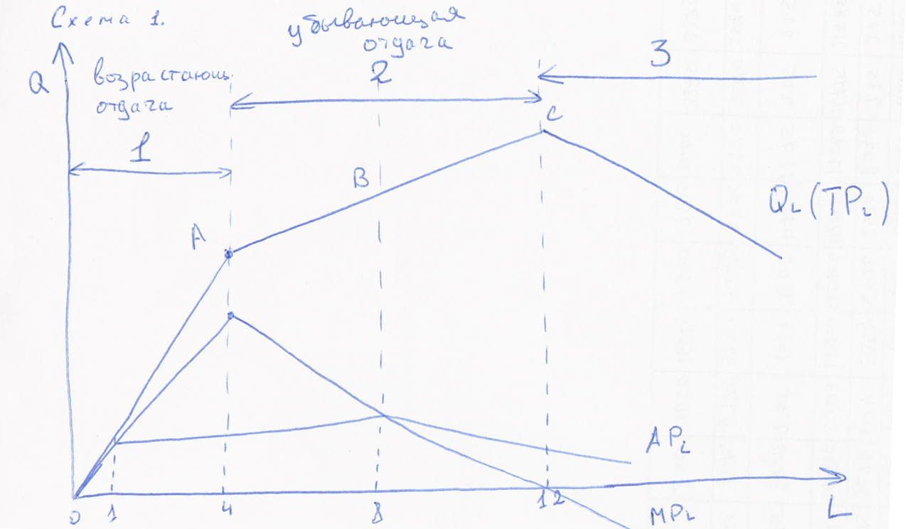

## Лекция 1

### Введение в экономику

#### Вопросы

1. Предмет, структура, функция
2. Методология современной науки
3. Основное противоречие экономики. Главные вопросы экономики. Проблема выбора. Кривая производственных возможностей.
4. Экономическая система. Решение главного вопроса экономики в различных экономических системах (самостоятельно)

#### Ответы

##### 3

###### Основное противоречие экономики.

Основная проблема экономической теории состоит в разрешении основного противоречия между безгранично растущими потребностями людей и ограниченностью ресурсов.

Потребность - это осознанная необходимость, то есть. недостаток в чем-то необходимом для поддержания жизнедеятельности и развития личности и общества.

В зависимости от очередности удовлетворения различают первичные и вторичные потребности.

- Первичные потребности связаны с физиологией человека. Это низшие потребности, они не взаимозаменяемы.
- Вторичные потребности  - это потребности, связанные с духовной, интеллектуальной и т. д. деятельностью. Они взаимозаменяемы.

Наиболее наглядно систему потребностей человечества описал Маслоу.

1. Физиологические потребности
2. Безопасность и защита (Защита от врагов, преступников, помощь при болезнях)
3. Социальные контакты (общение с людьми, имеющими такие же интересы, в дружбе, в любви)
4. Потребность в уважении (со стороны других людей, в самоуважении, в приобретении определенного общественного уважения)
5. Потребность в саморазвитии, самореализации. 

Потребности являются движущей силой в любой производственной деятельности и могут быть удовлетворены с помощью благ. Благо - это средство, удовлетворяющее потребности. Виды благ:

- С точки зрения ограниченности по отношению к потребностям людей:
  - Экономические - блага, участвующие в обмене, имеющиеся в ограниченном количестве
  - Неэкономические - общедоступные, имеющиеся в неограниченном количестве. 
- С точки зрения экономического содержания:
  - Материальные
  - Нематериальные
- В зависимости от характера потребностей:
  - Потребительские (то, что непосредственно удовлетворяет потребности человека)
  - Производственные (те, что используются в процессе производства)
- С точки зрения ограничения доступа потребителя к благам:
  - Частный - предоставляются только тем, кто за них заплатил
  - Общественные - блага, которыми пользуются все граждане без исключения (неделимые блага)

##### Основные вопросы экономики
Поскольку ресурсы ограниченны, и имеют множество вариантов использования. общество делает выбор между различными вариантами их применения, то есть, определяет, какие потребности будут удовлетворены в первую очередь, а какие отойдут на второй план. Любая экономическая деятельность сводится к принятию решения о том, *что, как и для кого* производить блага, удовлетворяющие человеческие потребности в условиях ограниченности ресурсов.

*Что* - Что производить, какие товары и услуги, и в каком количестве будут предложены потребителю для удовлетворения потребностей в настоящий момент, а какие - в будущий.

*Как* - выбор варианта производства вышеуказанных товаров.

*Для кого* - каким образом будут распределяться распределенные блага. (Купля-продажа, по талонам, по заслугам и т. д.)

Экономика - наука, изучающая, как общество с ограниченными ресурсами решает вопрос *что, как, и для кого производить продукт, удовлетворяющий потребности*.

Цель любой экономической деятельности - выбор наиболее эффективного варианта производства благ для удовлетворения максимальных потребностей. При минимальных затратах получаем максимальный результат. При этом производство одного продукта предполагает отказ от производства другого. Поэтому, чтобы сделать оптимальный экономический выбор, необходимо посчитать не только будущие затраты, но и издержки недоиспользованных производственных возможностей (альтернативные издержки). Альтернативные издержки - это издержки одного блага, выраженные в другом благе, которым пришлось пренебречь. Решение рационально, если дополнительные затраты равны дополнительной выгоде.

Рассмотрим проблему выбора на примере простейшей экономической модели кривой производственных возможностей. (КПВ). Кривая строится из предположения, что:

1. В обществе производятся только две группы товаров
2. Ресурсы ограничены, их качество и количество неизменно
3. Технология неизменна

Пусть в обществе производятся два блага: X и Y

Если все ресурсы используются для производства товара Y, то максимальный объем товара Y - 10 единиц; товара X тогда - 0 (точка А).

Если же все ресурсы используются для производства товара X, то максимальный объем товара X - 4; товара Y - 0 (точка Д).

Альтернативные варианты производства представлены точками Б, В, Г.

|                                                  | А    | Б    | В                    | Г    | Д                    |
| ------------------------------------------------ | ---- | ---- | -------------------- | ---- | -------------------- |
| Товар y                                          | 10   | 9    | 7                    | 4    | 0                    |
| Товар x                                          | 0    | 1    | 2                    | 3    | 4                    |
| Альтернативные издержки (упущенные возможности)- | –    | $$\frac{10-9}{1-0}$$ | $$\frac{9-7}{2-1}$$ |  $$\frac{7-4}{3-2}$$  | $$\frac{4-0}{4-3}$$ |

Соединив полученные точки, получим КПВ.

КПВ - кривая, показывающая альтернативно возможные варианты производства при полном и эффективном использовании ресурсов и неизменной технологии.

Если точка расположена ниже кривой, например, K (4Y + 1X), то производство возможно, но неэффективно. Если точка выше кривой. например, H (9Y+2X), производство невозможно.

Поскольку увеличивая производство одних благ, необходимо сократить производство другого блага, кривая убывающая. Причина этого в ограниченности ресурсов. Двигаясь по кривой вниз, мы не только сокращаем выпуск одного блага, но и перераспределяем ресурсы в пользу второго блага, и при этом сталкиваемся с альтернативными издержками, или издержками упущенной возможности. (Это количество одних благ, от производства которых мы готовы отказаться, чтобы увеличить производство другого блага на единицу.)

Например, двигаясь из точки А в точку Б, мы отказываемся от одной единицы блага Y, чтобы произвести одну дополнительную единицу блага X. Из точки Б в точку В - от двух Y в пользу одной дополнительной X. Это и есть альтернативные издержки. 

 По мере движения по кривой альтернативные издержки растут, согласно закону возрастающих альтернативных издержек.

 По мере увеличения объемов производства данного блага, альтернативные издержки производства дополнительных единиц второго блага, которым пришлось пренебречь, возрастают.

Рост альтернативных издержек объясняется тем, что при увеличении производства второго блага мы не только перераспределяем ресурсы, но и увеличиваем их расход. Поскольку ресурсы не обладают абсолютной взаимозаменяемостью, и нам приходится приспосабливать малоэффективные для этого производства ресурсы, переналаживать производство. Рост альтернативных издержек объясняет выпуклый характер кривой. (3-е свойство).

Чем ближе к пограничным точкам, тем выше альтернативные издержки, следовательно, ниже эффективность использования ресурсов.

В реальных задачах будет использоваться линейная функция ($$y=kx+b$$)

Изменение технологий приводит либо к сдвигу кривой (возможно увеличение производства двух благ), либо к изменению угла наклона.

## Лекция 2

### Рынок и механизм его функционирования

#### Вопрос 1

Рынок: сущность, черты, функции, роль. Структура и инфраструктура рынка. Объекты и субъекты рынка. 

#### Вопрос 2. 

Спрос, кривая спроса. Факторы, влияющие на спрос. 

#### Вопрос 3. 

Предложение, кривая предложения. Факторы, влияющие на предложение.

#### Вопрос 4

Рыночное равновесие, причины изменения равновесной цены и равновесного объема.

#### Вопрос 5 

Эластичность спроса, предложения, практическое значение теории эластичности.

**Рынок** - это система экономических отношений между продавцом и покупателем, основанная на частной собственности и механизме спроса и предложения. 

Условия возникновения рынка: 

1. Общественное разделение труда и специализация. 
2. Самостоятельность хозяйствующих субъектов - потребителя и производителя. 
3. Появление частной собственности.

Черты рынка:

1. Наличие товарной массы
2. Частная собственность на средства производства
3. Наличие устойчивых товарно-денежных отношений.
4. Наличие конкуренции.
5. Рынок подчинен действию законов.
6. Свободные цены.
7. Наличие трансакционных(?) издержек
8. Открытость экономики.

Функции рынка:

1. Информационная. Рынок через постоянно меняющиеся цены, процентные ставки по кредитам дает объективную информацию о спросе и предложении на товары и услуги. 
2. Посредническая. Рынок обеспечивает встречу экономически обособленных потребителей и производителей с целью обмена результатами труда.
3. Ценообразующая. 
4. Регулирующая. Рынок отвечает на вопросы "что. как и для кого производить", обеспечивает согласование производства и потребления, сбалансированность спроса и предложения
5. Стимулирующая. Стимулирует производителя внедрять что-то новое с целью снижения издержек. 
6. Контролирующая. Рынок - контроллер нашей деятельности, сигнал - прибыль.
7. Санирующая. Уничтожает нежизнеспособные предприятия. С помощью рыночных рычагов происходит освобождение общественного производства от нежизнеспособных предприятий.
8. Дифференцирующая. В условиях рыночной экономики общество делится на богатых и бедных.

Структура - это внутреннее строение, порядок отдельных элементов рынка, их удельный вес. 

1. По экономическому назначению объектов рыночных отношений:
   - Рынок благ и услуг
   - Рынок рабочей силы
   - Денежный рынок: рынок денег, финансовый рынок (ссудный, инвестиционный), рынок валют 
2. По товарным группам:
   - Рынок товаров производственного назначения
   - Рынок товаров народного потребления
   - Рынок факторов производства
3. По общественному разделению труда:

   - Местный
   - Национальный
   - Региональный
   - Мирововй

Плюсы рынка:

- Через постоянно меняющиеся цены дает ориентиры для капиталовложений
- Эффективное распределение ресурсов
- Саморегулирующий механизм
- Вложения в достижения науки и техники

Минусы рынка:

- Инфляция и безработица
- Дифференциация на богатых и бедных
- Нет заинтересованности в производстве общественных благ
- Наличие монополий
- Отрицательные внешние эффекты

#### Инфраструктура рынка

Инфраструктура - о, что облегчает встречу продавца и покупателя.

Совокупность правовых форм, опосредующих движение товаров и услуг, акты купли-продажи, или 
Это совокупность институтов, служб, предприятий, обслуживающих рынок и обеспечивающих его нормальное функционирование.

Элементы инфраструктуры - биржи, банки, информационные технологии, налоговая система, аукционы, ярмарки, и т. д. 

Функции инфраструктуры: 

1. Реализация интересов участников рынка

Субъекты и объекты рынка:

Основными субъектами рынка являются: домохозяйства и фирмы.

Домохозяйство - самостоятельно хозяйствующий субъект, состоящий из одного и более лиц, являющийся собственником ресурса, главная цель - удовлетворение потребностей.

Фирма - самостоятельно хозяйствующая единица, производящая товары и услуги с целью получения прибыли.

Два этих субъекта функционируют на рынке ресурсов, рынке товаров и услуг и финансовом рынке. 

Домохозяйство, являясь собственником ресурсов, предлагают их фирмам (1). В обратном направлении от фирм к домохозяйствам поступают факторные доходы в виде зарплаты, ренты, процента и прибыли (2). Таким образом, на рынке ресурсов фирмы являются покупателем, домохозяйства - продавцом. На рынке товаров и услуг фирма является продавцом, домохозяйство - покупателем. 

Фирма, используя получившиеся ресурсы, произвела товары и услуги, которые были приобретены потребителем (3). Домохозяйство, получив доходы, часть доходов тратит на приобретение товаров и услуг у фирм (4). Таким образом, расходы домохозяйств являются доходами фирм. Оставшуюся часть дохода домохозяйства сберегают (5), направляя их в различные финансовые институты. Это вклады в банки, в различные фонды, а также покупают акции и гос. облигации (5). Финансовый рынок полученные средства предоставляет фирмам в виде инвестиций и кредитов. В обратном направлении текут доходы от финансовых вложений: проценты и дивиденды (6).

Объекты рыночных отношений

Объекты рынка - это товар и деньги. Товар - экономическое благо, произведенное для обмена. 

Свойства:

1.  Потребительная стоимость (полезность) - способность блага удовлетворять потребности
2. Меновая стоимость (ценность) - это способность блага обмениваться в определенных пропорциях на другие блага.

Деньги.

Деньги - это особый товар, являющийся единым всеобщим эквивалентом, обладающий абсолютной ликвидностью (возможно обменять на все что угодно), облегчающие и ускоряющие обмен.

1. Потребительная стоимость - нужны людям как средство обмена и источник дохода
2. Меновая стоимость - можем обменять на любой товар. 

Виды денег:

- Товарные
- Символические, или декретные деньги
- Кредитные, или электронные деньги - электронные записи на технических носителях.

Функции денег:

- Мера стоимости
- Средство обмена
- Средство накопления
- Средство платежа - когда дата покупки не совпадает с датой оплаты.
- Мировые деньги

Цена - форма выражения ценности благ, проявляющееся в процессе обмена.

@todo доделать
Функции цены:

- 

Виды цен:

- 

#### Вопрос 2

**Спрос** - это количество товаров и услуг, которое потребитель желает и может приобрести за определенный период времени.

На спрос влияют следующие ценовые и не ценовые факторы:

1. Цена данного товара - $P_x$ - ценовой фактор, кривая на месте.
2. Цена товара-заменителя - $P_y$
3. Цена сопутствующего блага - $P_z$
4. Доходы потребителей - $I$
5. Вкусы и предпочтения 
6. Мода
7. …

Объем спроса - количество товаров, которое потребитель желает приобрести в данный момент по данной цене. Объем зависит только от цены.

Аналитической формой выражения функции спроса является уравнение:

$Q^D = a - b_xP_x+b_yP_y-b_zP_z\pm b_II$

a - величина, показывающая максимальный объем потребности в данном благе.

$b_x$ степень чувствительности объема спроса на товар $x$ на изменение его цены, всегда отрицательная величина

$b_y$ - отражает степень чувствительности объема спроса на товар $x$ при изменении цены на товар-заменитель

$b_z$ - отражает степень чувствительности объема спроса на товар $x$ при изменении цены на сопутствующее благо. Отрицательная величина.

$b_I$ - отражает степень чувствительности объема спроса на товар $x$ при изменении дохода потребителя. Может быть как положительной. так и отрицательной величиной.

Если принять все неценовые факторы за постоянные, то функция примет вид

$Q^D = a - bP$

Графически спрос представлен кривой спроса:

$b = \frac{1}{\tan\alpha} = \frac{\Delta Q}{\Delta P}$

Кривая спроса - это кривая, показывающая, какое количество товара и по какой цене готов приобрести потребитель.

Кривая спроса убывающая - это объясняется:

1. Законом спроса: если цена на какой-либо товар снижается, а все неценовые факторы остаются постоянными, то объем спроса растет, и наоборот.
2. Эффектом дохода. Эффект дохода: при более низкой цене потребитель может позволить себе купить больше данного продукта, не отказываясь от приобретения альтернативных благ.
3. Эффект замещения. Потребитель замещает относительно дорогой товар несколькими относительно него более дешевыми товарами. 

Кривая спроса возрастающая в случае товаров Гиффена и Веблена. 

#### ЛЕКЦИЯ 3

Если изменяется цена товара, а все неценовые факторы остаются постоянными, то говорят, что изменился объем спроса, кривая на месте, происходит движение по кривой.
Если же изменился один из неценовых факторов, а цена на данный товар осталась постоянной (по умолчанию), то говорят, что изменился спрос, кривая сместилась влево (спрос увеличился), или вправо (спрос уменьшился).

@todo l3pic1 (2 графика + формулы)

Предложение - то количество товара, которое фирма готова произвести и поставить на рынок в зависимости от ряда ценовых и неценовых факторов:

1. Цена данного товара $P_x$
2. Цена товарозаменителя $P_y$
3. Цена на ресурсы  $P_pec$
4. Доход фирмы или выручка от продаж
5. Издержки фирмы 
6. Уровень развития технологии
7. Количество проихводителей технологии

Налоги и субсидии

Объем предложения - количество товаров, которые фирма готова произвести и поставить на рынок в данный момент по данной цене.
Аналитически форма предложения имеет вид:

$A^S = a + b_x * P_x + b_y * P_y + b_pec * P_pec$
$a$ - величина, показывающая минимальный объем производства данного товара.
$b$ - коэффициент, покахывающий реакцию велечины предложения на изменение ценовых и неценовых факторов.
$b_x > 0$
$b_y < 0$
$b_pec < 0$

Если принять все неценовые факторы за постоянные, то функция примет вид:
$Q^S = a + b * P$
Как и спрос, предложение может быть описано аналитически, графически и в виде  массива данных.
Графически - представлено с помощью кривой предложения.
Кривая предложения - кривая, показывающая какое количество товара и по какой цене готова произвести и поставить на рынок фирма.

@todo l3pic2

Кривая возрастающая. Объясняется законом предложения: если цена на какой-либо товар растет, а все неценовые факторы остаются постоянны1%ми, то объем предложения растет.

Совместим кривые спроса и предложения. Они пересеклись в точке $E$. Говорят, что равновесие установилось при равновесной цене $P_e$ и равновесном объеме $Q_e$.
да
Равновесная цена - цена, при которой объем спроса равен объему предложения.

Равновесный объем - объем, при котором цена спроса равна цене предложения. 
Цена спроса - максимальная цена, которую потребитель готов заплатить за данное количество товара.
Цена предложения - минимальная цена, по которой фирма готова поставить данное количество товара на рынок.

@todo l3pic4

Равновесие является выражением максимальной эффективности рынка, поскольку:
1. Выигрывает и потребитель, и производитель.
2. Цена спроса превышает равновесную цену, поэтому выигрыш потребителя равен площади 1.
3. Цена предложения меньше равновесной цены, поэтому выигрыш производителя равен площади 2.
В состоянии равновесия рынок сбалансирован. Нет ни излишка, ни дефицита.

Пусть цена установилось выше равновесной. В этом случае объем предложения превышает объем спроса, на рынке образуются излишки. Чтобы избавиться от излишков, фирма уменьшает цели, и как следствие теряет прибыль.
Если цена установилась ниже равновесной, то объем спроса превышает объем предложения, образуется дефицит, и цены растут.
Если же меняется хотя бы один из неценовых факторов, то происходит смещение одной из кривых и изменение и равновесной цены, и равновесного объема.

Правило 1:
Рост спроса приводит к росту равновесной цены и равновесного объема.
Снижение спроса приводит к сокращению равновесной цены и равновесного объема.
Правило 2:
Рост предложения приводит к снижению равновесной цены и росту равновесного объема.
Снижение предложения приводит к росту равновесной цены и сокращению равновесного объема.

####Эластичность спроса, эластичность предложения
Эластичность спроса Подзаголовок
Эластичность спроса по цене - степень чувствительности объема спроса на данный товар к изменению его цены.
Для измерения степени чувствительности используют коэффициент эластичности $epsilon_dp$
Коэффициент эластичности спроса по цене показывает, насколько изменился объем спроса на данный товар при изменении его цены на 1%. Расчитывается как отношение процентного изменения объема спроса к процентному изменению цены. Величина безразмерная, всегда отрицательная, поскольку соглано закону спроса между ценой и объемом спроса обратная зависимость.

Спрос называют эластичным по цене, если изменение цены на 1% привело к большему изменению объема спроса.

@todo пропустил предложение

Например, коэффициент эластичности 0.5 Если цена выросла на 1%, значит объем спроса уменьшился на 0.5%.

Существует два метода расчета.
1. Дуговой. Он используется в том случае, если практические методы наблюдения не позволяют выявить функциональную зависимость между ценой товара и объемом спроса на него на каком то отрезке кривой спроса. Коэффициент расчитывается с учетом средней точки, и величина погрешности будет тем выше, чем вогнутей кривая

@todo f1 (график и формула)

2. Точечный. Используется в тех случаях, если необходимо расчитать коэффициент эластичности в конкретной точке и дан массив чисел.
Если выведена функциональная зависимость, используется производная.
@todo f2
3. Графический способ. Рисуется кривая, надо найти коэффициент эластичности в определенной точке.
@todo f3
По мере движения по кривой вниз коэффициент эластичности. По мере движения по кривой вниз коэфициент уменьшается от минус бесконечности до нуля, поскольку его фактическое значение зависит не только от угла наклона, но и от фактического значения цены и объема.
@todo f4
Различают пять видов реакции эластичности спроса: 
1. Абсолютно неэластичный спрос: соль, инсулин.
2. Неэластичный спрос. Изменение цены изменило в меньшей степени объем спроса.
3. Единично-эластичный спрос. Изменение цены привело к такому же изменению объема спроса.
@todo 5 графиков

На степень эластичности влияют следующие факторы:
1. Наличие товаров-заменителей: чем больше товаров-заменителей, тем более эластичен спрос.
2. Какую часть дохода мы тратим на приобретение данного товара: чем выше доля расходов на данный товар, тем выше степень эластичности.

3.  В зависимости от рассматриваемого периода. В краткосрочном периоде спрос менее эластичен, чем в долгосрочном. 
4. К какой категории относится этот товар. Предметы роскоши более эластичны. Предметы первой необходимости менее эластичны. 
5. Размер запасов. Чем больше запас, тем более эластичен спрос.
6. В зависимости от разнообразия возможностей использования. Чем более функционален товар, тем более эластичен спрос на него.

##### Перекрестная эластичность

Степень чувствительности спроса на один товар при изменении цены на другой товар называется перекрестной эластичностью спроса. Коэффициент перекрестной эластичности спроса $\epsilon^P_{dxy}$ показывает, как изменится объем спроса на один товар при изменении цены на другой товар на единицу. $= \frac_{%izmQ_x^D}{}$

2. Точечный $\epsilon^P_{dxy} = \frac{\frac{\Delta Q^x}{Q_0x}*100\%}{}$
3. Если дана функциональная зависимость $Q_x^D = a - b_xP_x\pm b_yP_y\pm b_II$, $\epsilon = Q'_{(P_y)}\frac{P_0^y}{Q_0^x}$

##### Коэффициент эластичности спроса по доходу

Энгель установил зависимость между доходом потребителя и расходами на приобретение четырех категорий благ.

@todo График C-I (расходы - доходы)

С ростом доходов расходы на товары первой необходимости не меняются ($E_1$).

На нормальные товары спрос растет, а затем стабилизируется ($E_2$).

На низшие блага (блага, у которых есть более качественные заменители) спрос сначала немного увеличивается, потом снижается. ($E_3$).

На предметы роскоши растет. ($E_4$).

Степень чувствительности спроса к изменению дохода потребителя называется эластичностью спроса по доходу. 

$\epsilon^I_d= \frac{\% изм Q_x^D}{\% изм P_y}$

Коэффициент эластичности спроса по доходу показывает, на сколько процентов изменится объем спроса при изменении дохода на 1%. Он может быть как положительным, так и отрицательным. 

@todo графики

В случае товаров первой необходимости коэфф. равен 0. (вертикальная черта)

В случае нормальных товаров 0<eps<1 (ветвь параболы)

Для предметов роскоши eps>1 (почти линейный график)

Низшие блага eps < 0 (график - дуга)

Способы расчета. 

1. Дуговой: $\epsilon^I_{d} = \frac{\frac{\Delta Q}{Q_{cp}}*100\%}{\frac{\Delta I}{\phi}} \frac{Q_1-Q_0}{Q_0} \frac{I_0}{I_1-I_0}$

2. Точечный $\epsilon^P_{dxy} = \frac{\frac{\Delta Q^x}{Q_0x}*100\%}{}$
3. Если дана функциональная зависимость $Q_x^D = a - b_xP_x\pm b_yP_y\pm b_II$, $\epsilon_d = Q'_{I}\frac{I_0}{Q_0}$

##### Эластичность предложения.

Степень чувствительности предложения к изменению одного из его факторов называется эластичностью предложения.

Степень чувствительность объема предложения данного товара к изменению его цены называется эластичностью предложения по цене. Данная степень чувствительности измеряется с помощью коэффициента эластичности предложения. Рассчитывается как отношение процентного изменения объема предложения к процентному изменению цены. Коэффициент показывает, насколько изменился объем предложения. если цена изменилась на 1%.

$\epsilon^S= \frac{\% изм Q^S}{\% изм P}$

Всегда положительная величина. Поскольку между ценой и объемом предложения существует прямая зависимость (закон предложения). 

Предложение эластично, если изменение цены приводит к большему изменению объема предложения. Напротив, предложение неэластично, если изменение цены приводит к меньшему изменению объема предложения. 

Методы расчета:

1. Дуговой - используется в том случае, если функциональную зависимость между ценой и объемом предложения вывести невозможно. 

   Дуговой: $\epsilon^S = \frac{\frac{\Delta Q}{Q_{cp}}*100\%}{\frac{\Delta P}{P_{ср}}} \frac{Q_1-Q_0}{Q_1+Q_0} \frac{P1+P_0}{P_1-P_0}$

   Точечный: $\epsilon^S = \frac{\frac{\Delta Q}{Q_0}*100\%}{\frac{\Delta P}{P_0}*100\%} \frac{Q_1-Q_0}{Q_0} \frac{P_0}{P_1-P_0}$

   Если дана функциональная зависимость $Q^S = a + bP$, $\epsilon^S = Q'\frac{P_0}{Q_0}$

   Графический

Значение коэффициента меняется от 0 до бесконечности. 

@todo: кривая поднимается вверх, от \epsilon = бесконечность, >1, =1, <1, =0. При небольших объемах производства предложение более эластично, поскольку у фирмы есть запас производственных мощностей. При больших объемах сложно увеличить объемы производства, поэтому предложение становится менее эластичным.

Различают пять типов реакции объема предложения на изменение цены. 

1. Абсолютно неэластичное предложение
2. Неэластичное предложение
3. Единичное предложение
4. Эластичное предложение
5. Идеал - абсолютно эластичное предложение. 

Факторы, влияющие на предложение:

1. Фактор времени, или протяженность рассматриваемого периода. Чем больше времени у предпринимателя для переналадки оборудования, тем выше предложение.
2. Наличие незагруженных производственных мощностей, свободной рабочей силы. Чем больше, тем выше степень эластичности. 
3. Возможность длительного хранения. Чем дольше срок хранения. тем более эластично предложение. 
4. Величина издержек. Если расширение выпуска связано с удорожанием производства, то эластичность предложения низкая. Производитель будет увеличивать объемы производства только в случае значительного роста цены. 
5. Вид предлагаемых товаров. Если технология изготовления товаров меняется без значительных вложений, то предложение этого товара более эластично. 

#### Практическое значение теории эластичности. 

Теория эластичности имеет большое значение для определения ценовой политики и политики налогообложения. 

Коэффициент эластичности спроса: 

1. Зная величину к.э.с. по цене, можно определить диапазон изменения цены с целью роста выручки (доход с продаж). $TR=PQ$. @todo график e=oo, e>1, e=1, e<1, e=0. На графике указана кривая выручки. Выручка максимальна, когда e = 1. Цена снижается на эластичном отрезке, при этом выручка растет. При снижении цены на неэластичном отрезке выручка падает. Если спрос по цене эластичен, то снижение цены приводит к росту выручки (незначительное снижение цены компенсируется ростом объема спроса). Рост цены приводит к снижению выручки (меньше объем спроса). Если спрос по цене неэластичен, то снижение цены приводит к снижению выручки (снижение цены не компенсируется ростом объемов продаж). Рост цены приводит к росту выручки. 
2. Зная к.э.с. по цене и к.э.п. можно определить, на чьи плечи ляжет налоговое бремя в случае ввода товарных (косвенных) налогов - НДС, таможенная пошлина, акцизы. Если спрос по цене неэластичен, то большая часть налогового бремени ложится на плечи @todo На графике неэластичная кривая спроса и кривая предложения (S). Кривая S сместится на величину налога и станет S1. Равновесие установится в новой точке P_e1. Ранее покупали по цене P_e Q_e товара. Теперь по цене P_e1 - Q_e1 товара. Прямоугольник Pe_1->e_1->P_e->K - это налоговое бремя покупателя. Цена, которая осталась у фирмы после уплаты налога - P_1. Так, P1->Pe->K->L - это налоговое бремя производителя. Если спрос неэластичен, то большая часть налогового бремени ложится на потребителя (у товара нет заменителей, и в случае повышения цены потребитель не перейдет на товары-заменители). Если спрос по цене эластичен, то большая часть налогового бремени ложится на плечи производителя. В случае неэластичного предложения большая часть налогового бремени ложится на плечи производителя, поскольку он не может быстро изъять ресурсы из этой отрасли и перейти на производство иного товара. Если предложение эластично, то большая часть налогового бремени ложится на потребителя. (если переложить на плечи производителя, то он быстро изымет ресурсы из этой области).
3. Коэффициент перекрестной эластичности показывает на тип взаимосвязи благ в потреблении. Предпринимателю важно знать, что произойдет со спросом на его товар в случае изменения цены на взаимозаменяемые и взаимодополняемые товары, и определить - увеличивать их или сокращать производство. 
4. Коэффициент эластичности по доходу. Следует сократить или увеличить выпуск товара при изменении дохода потребителя? 

## Лекция 4

Вопрос 1. Фирма в системе рыночных отношений. Организационно-правовые формы (самостоятельно)

Вопрос 2. Производственная функция

Вопрос 3. Производство в краткосрочном периоде: общий, средний, предельный продукт фирмы.

Вопрос 4. Издержки производства. Бухгалтерские и экономические. Издержки в краткосрочном периоде.

Вопрос 5. Общий доход и прибыль. 

Вопрос 6. Стратегия фирмы в долгосрочном периоде: издержки в долгосрочном периоде, изокоста, изокванта.

Вопрос 7. Правила минимизации издержек и максимизации прибыли.

### Вопрос 2

Задача предпринимателя - выбрать такую комбинацию ресурсов, чтобы получить максимальную прибыль и минимальные издержки.

Зависимость между количеством ресурсов, затраченных фирмой, и максимально возможным объемом выпуска называется производственной функцией. $Q = f(K, L)$. В общем виде производственная функция двухфакторной модели имеет вид $Q = f(K, L)$. K - капитал, L - труд, Q - кол-во продукции. Пр-ая функция может быть представлена в виде ф-ии, изокванты, производственной сетки. 

Свойства функции:

1. Описывает зависимость между затратами ресурсов и выпуском при условии, что способ производства технологически эффективен. 
2. Описывает максимальный объем выпуска продукции при каждой заданной комбинации ресурсов.
3. Показывает альтернативно возможные комбинации факторов, обеспечивающие одинаковый выпуск продукции. 

Если меняется способ производства, меняется и производственная функция.

Если один из факторов остается постоянным, это краткосрочно.

Краткосрочный период - это период, в течение которого одни факторы могут изменяться, а вторые нет. 

Долгосрочный период - это период, в течение которого фирма может изменить количество всех используемых факторов. 

Общий продукт (объем производства) обозначается либо Q, либо TP. Общий продукт - это суммарное количество продукции, произведенное фирмой за определенный период времени. 

Средний продукт обозначается AP. Это выпуск продукции в расчете на одну единицу переменного фактора. Он показывает, какое количество произведенной продукции приходится на одну единицу переменного фактора. 

Средний продукт труда $AP_L = \frac{TP}{L}$ или $\frac{Q}{L}$ - производительность труда, или количество продукции на одного рабочего. 

Средний продукт капитала $AP_K = \frac{TP}{K}$ или $\frac{Q}{K}$ - производительность капитала, или количество продукции на одну единицу капитала. 

Предельный продукт труда - это прирост общего продукта в результате использования дополнительной единицы переменного фактора.

$MP_L = \frac{\Delta TP}{\Delta L} = \frac{\Delta Q}{\Delta L}$

$MP_K = \frac{\Delta TP}{\Delta K} = \frac{\Delta Q}{\Delta K}$

Если дана функция, то $MP = (TP)'$ или $Q'$, причем берется производная либо по L, либо по K

Пусть капитал постояннен. Тогда графики общего, среднего, предельного продукта имеют следующий вид:

1 стадия характеризуется ростом отдачи от переменного фактора, т.е., при росте численности рабочих до 4-х наблюдается значительный рост объемов производства, среднего и предельного продукта. (предельный достигает максимума). Это объясняется следующим: при существующей технологии найм каждого дополнительного рабочего приводит к тому, что:

1. Обслуживается все большее количество станков, и выпуск продукции резко растет. 
2. Возрастает предельный продукт труда, т.е., каждая дополнительная единица переменного фактора увеличивает объем производства на величину большую, чем предыдущая. 

Но поскольку на данной стадии недоиспользуется постоянный ресурс (капитал), фирма увеличивает количество переменного фактора (найм рабочих).

2 стадия характеризуется убывающей отдачей от переменного фактора. 

Сегмент AB: увеличение численности рабочих с 4 до 8 сопровождается снижением темпов роста общего продукта, снижением предельного продукта, но имеет место рост среднего продукта (он достигает максимума, и равен предельному продукту). Рост среднего продукта объясняется следующим: капитал задействован не полностью, отдача от постоянного фактора растет, рост отдачи от постоянного фактора на сегменте AB перекрывает снижение отдачи от переменного фактора. Поэтому объем производства растет медленными темпами. 

Сегмент BC: увеличение численности рабочих с 8 до 12 сопровождается дальнейшим замедленным ростом объемов производства (в точке C объем - Q - максимален), дальнейшим снижением предельного продукта (он имеет положительное значение), снижением среднего продукта, поскольку станочный парк становится мал для данного количества рабочих. 

3 стадия характеризуется отрицательной отдачей от масштаба. Общий продукт снижается, предельный - принимает отрицательное значение.  Производство становится экономически неэффективным. Это объясняется законом убывающей производительности (убывающей эффективности). Следует отметить, что данный закон математически не доказан, а выведен эмпирически. Начиная с некоторого момента, последовательное приращение переменного фактора при неизменном количестве остальных приводит к снижению предельной производительности переменного ресурса.

### Вопрос 3. Издержки производства

Издержки - это затраты на производство и реализацию продукции. 

Виды издержек:

1. В зависимости от того, оплачивает фирма данный ресурс или нет, издержки бывают явные (внешние) и неявные (внутренние).
2. В зависимости от методов оценки, ресурсы делятся на бухгалтерские и экономические.
3. В зависимости от изменения объемов производства: постоянные (косвенные) и переменные (прямые).

Явные и неявные издержки (внешние и внутренние). Явные - денежные выплаты поставщикам факторов производства и промежуточных изделий. Явные издержки отражаются в бухгалтерской отчетности, поэтому их называют бухгалтерскими. Явные издержки делятся на прямые и косвенные. Прямые - это затраты, величина которых меняется с изменением объемов производства. К ним относятся материально-производственные затраты (оплата сырья, материалов, топлива, энергии и т. д.)  и затраты на оплату труда наемных рабочих (а также выплаты, предусмотренные трудовым договором). Косвенные - это затраты, величина которых не изменяется при изменении объемов производства. К ним относятся отчисления в фонд социального страхования, ПФ, медицинский и т. д. , амортизация оборудования (амортизационные отчисления = стоимость оборудования / срок службы), процент по кредиту, арендная плата, содержание территории, оплата труда управленческого персонала.

Претендующие на коммерческий успех предприниматели должны рассчитывать экономические издержки (обозначаются C). $C_{эк} = C_{бух} + C_{неявн}$. Неявные издержки - это затраты фирмы на собственный и самостоятельно используемый ресурс. Учитывается только то, что упущено. Неявные издержки носят внутренний характер, они не предусмотрены контрактами, поскольку не связаны с выплатой денег со счета фирмы. Они равны тем платежам, которые можно было бы получить при альтернативных вариантах использования. Сюда же относится нормальная прибыль (доход предпринимателя от использования собственных способностей). 

Невозвратные издержки - расходы, которые несет фирма при открытии, за право выхода на рынок. Они не участвуют в расчетах цен и экономических издержек.

#### Издержки в краткосрочном периоде

@todo схема 3

1 группа - постоянные (косвенные) издержки (FC). Постоянные издержки- это затраты, не зависящие от объема производства.

2 группа - переменные (прямые) издержки (VC). Линия выходит из 0.

3 группа - валовые издержки (TC). При Q = 0 в краткосрочном периоде TC = FC

4 группа - средние издержки. Это величина издержек, приходящаяся на единицу продукции. Различают средние постоянные издержки ($AFC = \frac{FC}{Q}$), средние переменные издержки ($AVC = \frac{VC}{Q}$), средние общие издержки ($ATC = \frac{TC}{Q}$ или $ATC = AVC + AFC$)

Кривая AFC всегда убывает. Кривые AVC и ADC имеют форму параболы. 

Кривая AVC сначала убывает, затем начинает расти, и по мере роста сближается с кривой AVC, но они  не сливаются. До точки перегиба (M) на динамику ATC существенное влияние оказывают AFC - средние постоянные издержки, которые при небольших объемах весьма высоки, а AVC не оказывают практически никакого воздействия, поскольку объемы невелики, следовательно, невелики затраты на сырье, рабочую силу и т. д. После точки перегиба на поведение ATC влияют AVC, поскольку растут затраты на сырье и т. д., а AFC - незначительны.  На отрезке Q1Q2 рост AVC не сопровождается ростом ATC. Это объясняется тем, что рост AVC компенсируется падением AFC.

#### Связь между средними издержками и средним продуктом

Предельные издержки - это затраты фирмы на производство каждой дополнительной единицы продукции. 

$\int MC = \frac{\Delta TC}{\Delta Q}$ или $\int MC = \frac{\Delta VC}{\Delta Q}$.  $\int MC = (TC)'$. $MC = (VC)'$. $VC = \int MC$ 

Кривая MC пересекает кривые ATC, AVC в точках их минимума

@todo схема 4

Предельные издержки показывают, стоит ли увеличивать объемы производства, или целесообразно их сократить.