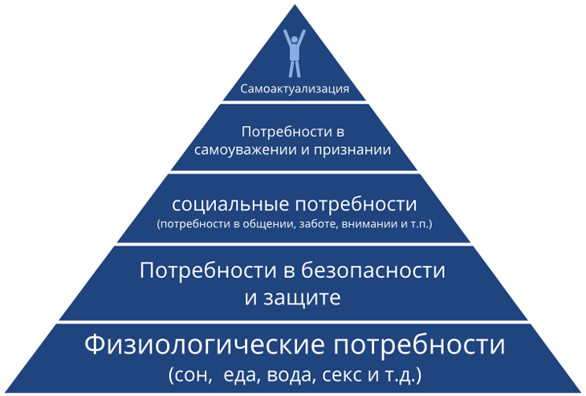

## Лекция 1

### Введение в экономику

#### Вопросы

1. Предмет, структура, функция
2. Методология современной науки
3. Основное противоречие экономики. Главные вопросы экономики. Проблема выбора. Кривая производственных возможностей.
4. Экономическая система. Решение главного вопроса экономики в различных экономических системах (самостоятельно)

#### Ответы

##### 3
Основное противоречие экономики.

Основная проблема экономической теории состоит в разрешении основного противоречия между безгранично растущими потребностями людей и ограниченностью ресурсов.

Потребность - это осознанная необходимость, то есть. недостаток в чем-то необходимом для поддержания жизнедеятельности и развития личности и общества.

В зависимости от очередности удовлетворения различают первичные и вторичные потребности.

- Первичные потребности связаны с физиологией человека. Это низшие потребности, они не взаимозаменяемы.
- Вторичные потребности  - это потребности, связанные с духовной, интеллектуальной и т. д. деятельностью. Они взаимозаменяемы.

Наиболее наглядно систему потребностей человечества описал Маслоу.

1. Физиологические потребности
2. Безопасность и защита (Защита от врагов, преступников, помощь при болезнях)
3. Социальные контакты (общение с людьми, имеющими такие же интересы, в дружбе, в любви)
4. Потребность в уважении (со стороны других людей, в самоуважении, в приобретении определенного общественного уважения)
5. Потребность в саморазвитии, самореализации. 

Потребности являются движущей силой в любой производственной деятельности и могут быть удовлетворены с помощью благ. Благо - это средство, удовлетворяющее потребности. Виды благ:

- С точки зрения ограниченности по отношению к потребностям людей:
  - Экономические - блага, участвующие в обмене, имеющиеся в ограниченном количестве
  - Неэкономические - общедоступные, имеющиеся в неограниченном количестве. 
- С точки зрения экономического содержания:
  - Материальные
  - Нематериальные
- В зависимости от характера потребностей:
  - Потребительские (то, что непосредственно удовлетворяет потребности человека)
  - Производственные (те, что использоуются в процессе производства)
- С точки зрения ограничения доступа потребителя к благам:
  - Частный - предоставляются только тем, кто за них заплатил
  - Общественные - блага, которыми пользуются все граждане без исключения (неделимые блага)