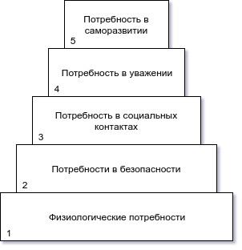
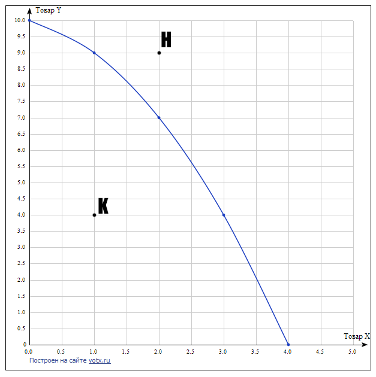

## Лекция 1

### Введение в экономику

#### Вопросы

1. Предмет, структура, функция
2. Методология современной науки
3. Основное противоречие экономики. Главные вопросы экономики. Проблема выбора. Кривая производственных возможностей.
4. Экономическая система. Решение главного вопроса экономики в различных экономических системах (самостоятельно)

#### Ответы

##### 3

###### Основное противоречие экономики.

Основная проблема экономической теории состоит в разрешении основного противоречия между безгранично растущими потребностями людей и ограниченностью ресурсов.

Потребность - это осознанная необходимость, то есть. недостаток в чем-то необходимом для поддержания жизнедеятельности и развития личности и общества.

В зависимости от очередности удовлетворения различают первичные и вторичные потребности.

- Первичные потребности связаны с физиологией человека. Это низшие потребности, они не взаимозаменяемы.
- Вторичные потребности  - это потребности, связанные с духовной, интеллектуальной и т. д. деятельностью. Они взаимозаменяемы.

Наиболее наглядно систему потребностей человечества описал Маслоу.

1. Физиологические потребности
2. Безопасность и защита (Защита от врагов, преступников, помощь при болезнях)
3. Социальные контакты (общение с людьми, имеющими такие же интересы, в дружбе, в любви)
4. Потребность в уважении (со стороны других людей, в самоуважении, в приобретении определенного общественного уважения)
5. Потребность в саморазвитии, самореализации. 

Потребности являются движущей силой в любой производственной деятельности и могут быть удовлетворены с помощью благ. Благо - это средство, удовлетворяющее потребности. Виды благ:

- С точки зрения ограниченности по отношению к потребностям людей:
  - Экономические - блага, участвующие в обмене, имеющиеся в ограниченном количестве
  - Неэкономические - общедоступные, имеющиеся в неограниченном количестве. 
- С точки зрения экономического содержания:
  - Материальные
  - Нематериальные
- В зависимости от характера потребностей:
  - Потребительские (то, что непосредственно удовлетворяет потребности человека)
  - Производственные (те, что используются в процессе производства)
- С точки зрения ограничения доступа потребителя к благам:
  - Частный - предоставляются только тем, кто за них заплатил
  - Общественные - блага, которыми пользуются все граждане без исключения (неделимые блага)

##### Основные вопросы экономики
Поскольку ресурсы ограниченны, и имеют множество вариантов использования. общество делает выбор между различными вариантами их применения, то есть, определяет, какие потребности будут удовлетворены в первую очередь, а какие отойдут на второй план. Любая экономическая деятельность сводится к принятию решения о том, *что, как и для кого* производить блага, удовлетворяющие человеческие потребности в условиях ограниченности ресурсов.

*Что* - Что производить, какие товары и услуги, и в каком количестве будут предложены потребителю для удовлетворения потребностей в настоящий момент, а какие - в будущий.

*Как* - выбор варианта производства вышеуказанных товаров.

*Для кого* - каким образом будут распределяться распределенные блага. (Купля-продажа, по талонам, по заслугам и т. д.)

Экономика - наука, изучающая, как общество с ограниченными ресурсами решает вопрос *что, как, и для кого производить продукт, удовлетворяющий потребности*.

Цель любой экономической деятельности - выбор наиболее эффективного варианта производства благ для удовлетворения максимальных потребностей. При минимальных затратах получаем максимальный результат. При этом производство одного продукта предполагает отказ от производства другого. Поэтому, чтобы сделать оптимальный экономический выбор, необходимо посчитать не только будущие затраты, но и издержки недоиспользованных производственных возможностей (альтернативные издержки). Альтернативные издержки - это издержки одного блага, выраженные в другом благе, которым пришлось пренебречь. Решение рационально, если дополнительные затраты равны дополнительной выгоде.

Рассмотрим проблему выбора на примере простейшей экономической модели кривой производственных возможностей. (КПВ). Кривая строится из предположения, что:

1. В обществе производятся только две группы товаров
2. Ресурсы ограничены, их качество и количество неизменно
3. Технология неизменна

Пусть в обществе производятся два блага: X и Y

Если все ресурсы используются для производства товара Y, то максимальный объем товара Y - 10 единиц; товара X тогда - 0 (точка А).

Если же все ресурсы используются для производства товара X, то максимальный объем товара X - 4; товара Y - 0 (точка Д).

Альтернативные варианты производства представлены точками Б, В, Г.

|                                                  | А    | Б    | В                    | Г    | Д                    |
| ------------------------------------------------ | ---- | ---- | -------------------- | ---- | -------------------- |
| Товар y                                          | 10   | 9    | 7                    | 4    | 0                    |
| Товар x                                          | 0    | 1    | 2                    | 3    | 4                    |
| Альтернативные издержки (упущенные возможности)- | –    | $$\frac{10-9}{1-0}$$ | $$\frac{9-7}{2-1}$$ |  $$\frac{7-4}{3-2}$$  | $$\frac{4-0}{4-3}$$ |

Соединив полученные точки, получим КПВ.

КПВ - кривая, показывающая альтернативно возможные варианты производства при полном и эффективном использовании ресурсов и неизменной технологии.

Если точка расположена ниже кривой, например, K (4Y + 1X), то производство возможно, но неэффективно. Если точка выше кривой. например, H (9Y+2X), производство невозможно.

@todo добавить точки

Поскольку увеличивая производство одних благ, необходимо сократить производство другого блага, кривая убывающая. Причина этого в ограниченности ресурсов. Двигаясь по кривой вниз, мы не только сокращаем выпуск одного блага, но и перераспределяем ресурсы в пользу второго блага, и при этом сталкиваемся с альтернативными издержками, или издержками упущенной возможности. (Это количество одних благ, от производства которых мы готовы отказаться, чтобы увеличить производство другого блага на единицу.)

Например, двигаясь из точки А в точку Б, мы отказываемся от одной единицы блага Y, чтобы произвести одну дополнительную единицу блага X. Из точки Б в точку В - от двух Y в пользу одной дополнительной X. Это и есть альтернативные издержки. 

 По мере движения по кривой альтернативные издержки растут, согласно закону возрастающих альтернативных издержек.

 По мере увеличения объемов производства данного блага, альтернативные издержки производства дополнительных единиц второго блага, которым пришлось пренебречь, возрастают.

Рост альтернативных издержек объясняется тем, что при увеличении производства второго блага мы не только перераспределяем ресурсы, но и увеличиваем их расход. Поскольку ресурсы не обладают абсолютной взаимозаменяемостью, и нам приходится приспосабливать малоэффективные для этого производства ресурсы, переналаживать производство. Рост альтернативных издержек объясняет выпуклый характер кривой. (3-е свойство).

Чем ближе к пограничным точкам, тем выше альтернативные издержки, следовательно, ниже эффективность использования ресурсов.

В реальных задачах будет использоваться линейная функция ($$y=kx+b$$)

Изменение технологий приводит либо к сдвигу кривой (возможно увеличение производства двух благ), либо к изменению угла наклона.